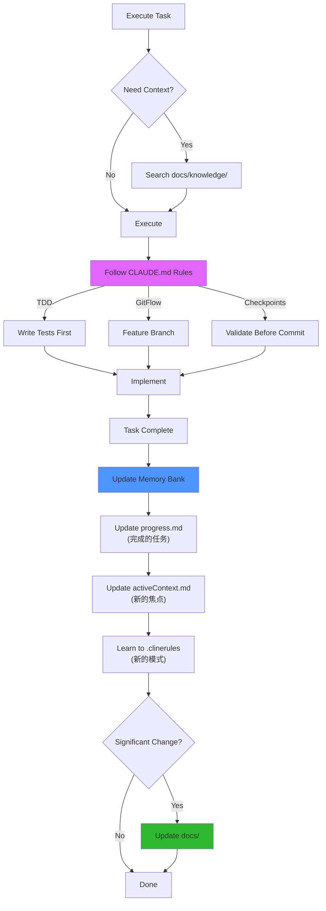

# Memory Bank + CLAUDE.md 集成方案

**创建日期**: 2025-11-17  
**类型**: 架构设计  
**状态**: [ACTIVE] - 待实施

---

## 🎯 核心设计理念

基于 Memory Bank 的 "Session-less AI" 定位，结合 CLAUDE.md 的行为规范，建立三层记忆架构：

```
CLAUDE.md (Layer 1: 行为宪法)
    ↓ 定义"如何工作"
Memory Bank (Layer 2: 项目上下文)
    ↓ 提供"工作上下文"
docs/ (Layer 3: 知识库)
    ↓ 存储"永久知识"
```

---

## 📚 三层记忆分工

### Layer 1: CLAUDE.md - 行为宪法层

**定位**: AI 的"操作系统"，定义行为规则

**内容**:
- 🧠 AI 工作流程（Session 启动/结束协议）
- 📋 开发规范（TDD、GitFlow、检查点）
- 🔧 工具选择规则
- ⚠️ 强制检查点

**更新频率**: 项目阶段性更新（低频）

**示例章节**:
```markdown
## 🧠 AI 工作流程

### Session 启动协议 (MANDATORY)
1. 执行 "follow your custom instructions"
2. 读取 Memory Bank (projectbrief → activeContext → progress)
3. 加载 .clinerules 学习的偏好
4. 向用户确认已恢复上下文

### Session 结束协议
1. 执行 "update memory bank"
2. 更新 progress.md 和 activeContext.md
3. 记录新学到的模式到 .clinerules
```

### Layer 2: Memory Bank - 项目上下文层

**定位**: AI 的"工作记忆"，Session 间持久化

**核心文件**（7个 + custom）:
```
~/.claude/memory-bank/serena/
├── projectbrief.md          # 项目根基（使命、架构、成功指标）
├── productContext.md        # 问题域（用户、竞争、解决方案）
├── systemPatterns.md        # 架构模式（设计决策、模式库）
├── techContext.md           # 技术栈（环境、工具、已知问题）
├── activeContext.md         # 当前焦点（Sprint、决策、阻塞）
├── progress.md              # 进度追踪（路线图、完成、指标）
├── .clinerules              # AI 学习偏好（工具、风格、工作流）
└── custom/
    ├── epic-001-status.md
    └── mcp-setup.md
```

**更新频率**: 每个 Task 完成后（高频）

**文件关系**:
```
projectbrief.md (根基)
    ↓ feeds into
productContext + systemPatterns + techContext (上下文)
    ↓ inform
activeContext.md (当前焦点)
    ↓ tracked in
progress.md (进度)
```

### Layer 3: docs/ - 知识库层

**定位**: 版本控制的永久知识

**内容**（从 Serena memories 迁移）:
```
docs/knowledge/              # 🆕 新增
├── architecture/
│   ├── serena-repository-structure.md
│   └── core-concepts-and-architecture.md
├── development/
│   ├── git-workflow.md
│   └── suggested-commands.md
├── lessons-learned/
│   ├── feature-2.2-tdd-lessons.md
│   └── story-2.2-day4-lessons.md
└── project-context/
    └── project-history-and-repositioning.md
```

**更新频率**: 重大决策和经验沉淀（中频）

---

## 🔄 AI 工作流程设计

### Session 启动流程

```mermaid
flowchart TD
    A[User: "follow your custom instructions"] --> B[Pre-Flight Validation]
    
    B --> C{Memory Bank exists?}
    C -->|No| D[Initialize Memory Bank]
    C -->|Yes| E[Read Core Files]
    
    D --> E
    
    E --> F["Read projectbrief.md<br/>(项目定位)"]
    F --> G["Read activeContext.md<br/>(当前焦点)"]
    G --> H["Read progress.md<br/>(进度状态)"]
    H --> I["Read .clinerules<br/>(学习偏好)"]
    
    I --> J[Load CLAUDE.md Rules]
    J --> K["✅ Context Restored<br/>向用户报告状态"]
    
    K --> L{Task Type?}
    L -->|查找历史| M[Search docs/knowledge/]
    L -->|执行开发| N[Execute with Rules]
    L -->|规划Epic| O[Read docs/product/]
    
    style B fill:#e066ff
    style K fill:#2eb82e
    style J fill:#4d94ff
```

### Task 执行流程



---

## 📋 Memory Bank 文件模板

### 1. projectbrief.md
```markdown
# EvolvAI Project Brief

## Core Mission
AI behavior engineering platform reducing TPST by 50-70% through:
- Behavior constraints
- Project standards
- Graph-of-Thought engine

## Three-Epic Architecture
- **Epic-001**: Behavior Constraints System (safe_search, batch_edit, safe_exec)
- **Epic-002**: Project Standards as MCP Service (.project_standards.yml)
- **Epic-003**: Graph-of-Thought Engine (Event sourcing + parallel branching)

## Success Metrics
- TPST reduction ≥ 50%
- Tool execution efficiency (via audit trail)
- Developer satisfaction (dogfooding)

## Project History
Evolved from Serena fork → Independent AI behavior optimization platform

📖 Full history: docs/knowledge/project-context/project-history-and-repositioning.md
```

### 2. activeContext.md
```markdown
# Active Context - [DATE]

## Current Sprint
- **Epic**: 001 - Behavior Constraints System
- **Story**: 2.2 - Batch Edit Tool Refactoring
- **Status**: In Development (80% complete)

## Current Focus
- Refactoring batch_edit error handling
- Integrating ExecutionPlan validation
- Improving test coverage to 90%

## Active Decisions
- Use regex-based replacement (not AST)
- Preview mode required before apply
- File-level rollback on failure

## Blockers
- None

## Next Up
- Story 2.3: safe_search implementation
- Story 2.4: safe_exec confirmation workflow

## Recent Learnings
- Interface mismatches caused 40% test failures
- BDD-style test naming improves clarity
- Checkpoint validation prevents over-engineering
```

### 3. progress.md
```markdown
# EvolvAI Development Progress

## Current Status
- **Active Epic**: 001 - Behavior Constraints
- **Current Story**: 2.2 - batch_edit refactoring (80%)
- **Next Story**: 2.3 - safe_search

## Roadmap

### Phase 0: Foundation ✅ COMPLETE
- [x] ToolExecutionEngine (Story 0.1)
- [x] Audit trail and TPST tracking

### Epic-001: Behavior Constraints 🔄 IN PROGRESS
- [x] Story 1.1: ExecutionPlan schema
- [x] Story 1.2: PlanValidator integration
- [x] Story 2.1: batch_edit implementation
- [ ] Story 2.2: batch_edit refactoring (80%)
- [ ] Story 2.3: safe_search
- [ ] Story 2.4: safe_exec

### Epic-002: Project Standards ⏳ PLANNED
### Epic-003: GoT Engine ⏳ PLANNED

## Recent Completions (Last 7 Days)
- 2025-11-17: Memory Bank integration design
- 2025-11-17: MCP configuration guide
- 2025-11-16: Story 2.2 Day 4 lessons learned

## Key Metrics
- Test Coverage: 80% (target: ≥90%)
- TPST Baseline: Not yet established
- Documentation: Up to date
```

### 4. .clinerules
```markdown
# EvolvAI AI Preferences

## Tool Usage Patterns
- Prefer `mcp__evolvai__*` tools for dogfooding
- Use `mcp__serena__*` for stable operations
- Always run `uv run poe format` before commits

## Code Style (Learned)
- Explicit type hints (mypy strict mode)
- Google-style docstrings
- Test files mirror source structure

## User Workflow Preferences
- TDD: Tests before implementation
- GitFlow: feature/* → develop → main
- Commit: Conventional Commits format
- Session start: "follow your custom instructions"
- Task complete: "update memory bank"

## Project-Specific Decisions
- Chinese comments allowed (ignore RUF003)
- ExecutionPlan required for constraint tools
- Memory Bank updates after each Story
- Memory system: 3-layer architecture (CLAUDE.md + Memory Bank + docs/)
```

---

## 🚀 迁移实施计划

### Week 1: 初始化 Memory Bank

**Day 1-2: 创建核心文件**
```bash
# 1. 创建目录
mkdir -p ~/.claude/memory-bank/serena/custom

# 2. 创建核心文件
cd ~/.claude/memory-bank/serena
touch projectbrief.md productContext.md systemPatterns.md \
      techContext.md activeContext.md progress.md .clinerules

# 3. 填充模板内容（使用上面的模板）
```

**Day 3-4: 内容迁移**
```bash
# 从 Serena memories 提取核心内容
# projectbrief.md ← project-history-and-repositioning.md (摘要)
# systemPatterns.md ← serena_core_concepts_and_architecture.md
# techContext.md ← mcp-configuration-guide.md
# progress.md ← project-task-management-status-*.md
```

**Day 5: 迁移到 docs/knowledge/**
```bash
# 创建结构
mkdir -p docs/knowledge/{architecture,development,lessons-learned,project-context}

# 迁移文件
mv .serena/memories/serena_repository_structure.md \
   docs/knowledge/architecture/

mv .serena/memories/project-history-and-repositioning.md \
   docs/knowledge/project-context/

mv .serena/memories/serena_core_concepts_and_architecture.md \
   docs/knowledge/architecture/core-concepts.md

mv .serena/memories/feature-2.2-tdd-lessons-learned.md \
   docs/knowledge/lessons-learned/

mv .serena/memories/story-2.2-day4-lessons-learned.md \
   docs/knowledge/lessons-learned/

# 归档旧 memories
mkdir -p docs/archive/legacy-memories-2025-11-17
mv .serena/memories/*.md docs/archive/legacy-memories-2025-11-17/
```

### Week 2: 更新 CLAUDE.md

**新增章节**:
1. "🧠 AI 工作流程" (Session 协议)
2. "📚 知识访问指南" (三层使用规则)
3. 更新 "🔧 MCP Servers Configuration" (加入 Memory Bank)

**示例内容**:
```markdown
## 🧠 AI 工作流程

### Session 启动协议 (MANDATORY)

每个新 Session 开始时，AI 必须执行以下流程：

**触发**: User 说 "follow your custom instructions"

**步骤**:
1. **Pre-Flight Validation**
   - 检查 Memory Bank 是否存在
   - 如不存在，执行 "initialize memory bank"

2. **Read Memory Bank** (按顺序)
   ```
   1. projectbrief.md (项目定位和目标)
   2. activeContext.md (当前 Sprint 焦点)
   3. progress.md (开发进度)
   4. .clinerules (学习的用户偏好)
   ```

3. **Load Behavior Rules**
   - 加载本文档所有规范
   - TDD 工作流程
   - GitFlow 分支策略
   - Mandatory Checkpoints

4. **Report Status**
   ```
   ✅ Context restored:
   - Current Epic: [Epic-001]
   - Active Story: [2.2 - batch_edit refactoring]
   - Focus: [Error handling improvements]
   - Progress: [80% complete]
   - Blockers: [None]
   
   Ready to continue. What would you like to work on?
   ```

### Session 结束协议

**触发**: User 说 "update memory bank" 或 Task 完成

**步骤**:
1. **Update Memory Bank**
   ```
   memory_bank_update(
     projectName="serena",
     fileName="progress.md",
     content="[Add completed tasks]"
   )
   
   memory_bank_update(
     fileName="activeContext.md",
     content="[Update current focus]"
   )
   
   memory_bank_update(
     fileName=".clinerules",
     content="[Learn new patterns]"
   )
   ```

2. **Documentation Check**
   - 如果有架构决策 → 创建 ADR
   - 如果有重要经验 → 更新 lessons-learned
   - 如果有重大变更 → 更新相关 docs/

### 知识访问规则

| 需求 | 访问层 | 工具 |
|------|--------|------|
| 恢复项目上下文 | Memory Bank | `memory_bank_read(projectbrief/activeContext)` |
| 查找历史决策 | docs/knowledge/ | `Read(docs/development/architecture/adrs/)` |
| 学习代码架构 | docs/knowledge/ | `Read + find_symbol` |
| 查看当前进度 | Memory Bank | `memory_bank_read(progress.md)` |
| 理解问题域 | Memory Bank | `memory_bank_read(productContext.md)` |
| 复习经验教训 | docs/knowledge/ | `Read(docs/knowledge/lessons-learned/)` |
```

### Week 3: 建立使用习惯

**AI 行为模式**:
- ✅ 每个 Session 自动读取 Memory Bank
- ✅ 每个 Task 完成后自动更新 Memory Bank
- ✅ 重大决策同时更新 docs/ 和 Memory Bank

**用户习惯培养**:
- Session 开始: "follow your custom instructions"
- Task 完成: "update memory bank"
- Sprint 切换: 手动更新 activeContext.md

---

## 📊 预期效果

### TPST 优化

**Scenario: Session 恢复**

Before (无 Memory Bank):
```
User: "继续 Story 2.2"
AI: "我需要先了解 Story 2.2 是什么..."
     [读取多个文件，消耗 5000+ tokens]
```

After (有 Memory Bank):
```
User: "follow your custom instructions"
AI: [读取 Memory Bank 4 个文件，消耗 1000 tokens]
     "✅ Context restored: Story 2.2 batch_edit refactoring, 80% complete"
```

**Token 节省**: 80% (4000 tokens per session)

### 知识管理效率

**Before**:
- 知识散落在 Serena memories
- 无结构，难以快速定位
- Session 间上下文丢失

**After**:
- 三层清晰分工
- Memory Bank 即时上下文
- docs/ 深度知识库
- .clinerules 持续学习

---

## ✅ 验收标准

### Week 1 完成标准
- [ ] Memory Bank 7 个核心文件创建并填充内容
- [ ] Serena memories 迁移到 docs/knowledge/ 完成
- [ ] 旧 memories 归档到 docs/archive/

### Week 2 完成标准
- [ ] CLAUDE.md 更新 "🧠 AI 工作流程" 章节
- [ ] CLAUDE.md 更新 "📚 知识访问指南" 章节
- [ ] Memory Bank MCP 配置并测试可用

### Week 3 验收指标
- [ ] 至少 3 次 Session 使用 "follow your custom instructions"
- [ ] 至少 2 次 Task 完成后 "update memory bank"
- [ ] Session 恢复时间 < 30 秒
- [ ] 知识查找成功率 > 90%

---

**维护者**: EvolvAI Team  
**最后更新**: 2025-11-17  
**状态**: 待实施  
**下次审查**: Week 2 结束

**相关文档**:
- memory-system-migration-analysis.md
- CLAUDE.md (待更新)
- docs/.structure.md
