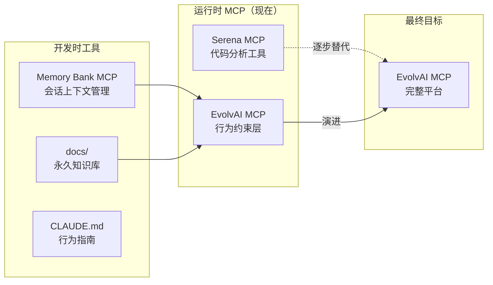

# EvolvAI 架构演进路线图

**Status**: [ACTIVE]
**Last Updated**: 2025-11-18
**Purpose**: 记录从 Serena Fork 到独立 EvolvAI MCP 的演进路线

---

## 📊 当前架构状态



---

## 🚨 关键认知更新

### 1. Serena Memory 已废弃

**上游状态**：
- Serena 项目的 memory 功能已标记为 **DEPRECATED**
- 上游项目功能定位已偏移（不再聚焦 AI 行为优化）
- `.serena/memories/` 系统不再维护

**我们的响应**：
```yaml
替代方案:
  开发时: Memory Bank MCP + docs/ + CLAUDE.md
  运行时: EvolvAI 内部 memo 系统（Epic-002/003）

迁移状态:
  - Memory Bank MCP: ✅ 已集成
  - docs/ 重组: ✅ 已完成
  - CLAUDE.md 更新: ✅ 已完成
  - Serena memory 工具: ⚠️ 保留但标记废弃
```

### 2. EvolvAI 最终将替代 Serena

**演进路线**：

```
Phase 1（当前）: 依赖 Serena
- 使用 Serena LSP 基础设施
- 使用 Serena 符号操作工具
- EvolvAI 作为行为约束层

Phase 2: 部分替代
- 保留核心 LSP 功能
- 移除无关功能（memory、不需要的工具）
- EvolvAI 工具优先级提升

Phase 3: 完全替代
- EvolvAI MCP 成为独立平台
- 裁剪后的 LSP 核心集成进 EvolvAI
- 所有功能围绕 TPST 优化
```

---

## 📋 功能迁移矩阵

| 功能类别 | Serena MCP | EvolvAI MCP | 迁移策略 |
|---------|-----------|------------|---------|
| **LSP 符号操作** | ✅ 成熟 | 🔄 继承 | 保留核心，优化接口 |
| **文件操作** | ✅ 有 | ✅ safe_edit | 约束化替代 |
| **搜索功能** | ✅ 无约束 | ✅ safe_search | 约束化替代 |
| **命令执行** | ✅ 直接 | ✅ safe_exec | 约束化替代 |
| **Memory 系统** | ❌ 废弃 | 🔄 规划中 | Epic-002/003 |
| **行为约束** | ❌ 无 | ✅ 核心 | EvolvAI 创新 |
| **TPST 追踪** | ❌ 无 | ✅ 核心 | EvolvAI 创新 |
| **GoT 引擎** | ❌ 无 | 🔄 规划中 | Epic-003 |

---

## 🎯 裁剪策略

### 保留的 Serena 功能

✅ **必须保留**：
- `SolidLanguageServer` - LSP 包装器
- `find_symbol`, `replace_symbol_body` - 符号操作
- `get_symbols_overview` - 代码导航
- 多语言支持基础设施

⚠️ **暂时保留**：
- 基础文件工具（逐步被 safe_* 替代）
- 项目管理框架（需要改造）

### 移除的 Serena 功能

❌ **立即废弃**：
- Memory 系统（已用 Memory Bank MCP 替代）
- `read_memory`, `write_memory` 等工具

❌ **逐步移除**：
- 非约束化的搜索/编辑工具
- 与 AI 行为优化无关的功能
- 过度复杂的配置系统

---

## 🚀 实施路线图

### Stage 1: 双轨运行（当前）
**时间**: 2025 Q1
**目标**: EvolvAI 和 Serena 并行使用

```yaml
状态:
  - Memory Bank MCP: ✅ 开发时上下文
  - Serena MCP: ✅ 代码操作
  - EvolvAI MCP: 🔄 行为约束（开发中）

工作重点:
  - 完成 Epic-001（行为约束）
  - 验证 safe_* 工具效果
  - 收集 TPST 数据
```

### Stage 2: 功能迁移
**时间**: 2025 Q2
**目标**: EvolvAI 功能完备

```yaml
计划:
  - 实现 Epic-002（项目标准 MCP）
  - 开始 Epic-003（GoT 引擎）
  - 逐步替代 Serena 工具
  - 性能基准对比
```

### Stage 3: 独立运行
**时间**: 2025 Q3
**目标**: EvolvAI MCP 独立

```yaml
目标:
  - 完全替代 Serena MCP
  - 裁剪集成必要 LSP 功能
  - TPST 降低 50-70%
  - 发布 1.0 版本
```

---

## 📚 文档体系（最终状态）

```yaml
开发时:
  Memory Bank MCP:
    - 会话上下文管理
    - 项目状态持久化
    - 学习模式积累（.clinerules）

  docs/:
    - 架构决策（ADR）
    - 经验教训（Lessons）
    - 项目规范（Specs）

  CLAUDE.md:
    - AI 行为指南
    - 工具使用规则
    - 开发流程

运行时:
  EvolvAI MCP:
    - 行为约束系统（Epic-001）
    - 项目标准服务（Epic-002）
    - GoT 思维引擎（Epic-003）
    - 内部 memo 系统（替代 Serena memory）
```

---

## ⚠️ 风险与缓解

### 风险 1: LSP 功能依赖
**风险**: 过度依赖 Serena LSP 基础设施
**缓解**:
- 保持 LSP 接口稳定
- 逐步抽象核心功能
- 建立独立测试套件

### 风险 2: 功能覆盖不全
**风险**: EvolvAI 工具未完全覆盖 Serena 功能
**缓解**:
- 双轨运行期充分测试
- 保持向后兼容
- 渐进式迁移

### 风险 3: 性能退化
**风险**: 约束系统导致性能下降
**缓解**:
- 建立性能基准
- 优化关键路径
- 智能缓存策略

---

## 📊 成功指标

### 短期（3个月）
- [ ] Epic-001 完成，safe_* 工具稳定
- [ ] TPST 基准数据收集完成
- [ ] Memory Bank MCP 完全替代 Serena memory

### 中期（6个月）
- [ ] Epic-002 完成，项目标准 MCP 上线
- [ ] 50% Serena 功能被 EvolvAI 替代
- [ ] TPST 降低 30%

### 长期（12个月）
- [ ] EvolvAI MCP 完全独立
- [ ] TPST 降低 50-70%
- [ ] 开源发布 1.0 版本

---

## 🔗 相关文档

- [Memory Bank 工作流程](./memory-bank-workflow.md)
- [三 Epic 架构](../product/definition/evolvai-product-definition.md)
- [CLAUDE.md](/Users/dreamlinx/Dropbox/Projects/opensource/serena/CLAUDE.md)
- [上游 Serena 项目](https://github.com/oraios/serena)