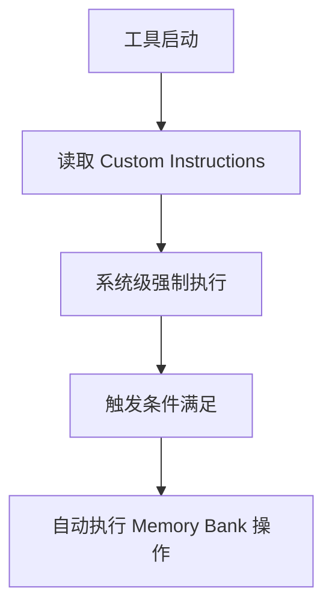

# Claude Code 与 Memory Bank MCP 集成方案

**Status**: [ACTIVE]
**Last Updated**: 2025-11-18
**Purpose**: 分析 Claude Code 的机制并设计正确的 Memory Bank 集成方案

---

## 🎯 关键认知：Claude Code 的独特性

### Claude Code vs 其他 AI 编程工具

| 工具 | Custom Instructions 支持 | 触发机制 |
|-----|-------------------------|----------|
| **Cline/Roo** | ✅ Extension Settings | 系统级自动 |
| **Cursor** | ✅ Rules for AI | 系统级自动 |
| **Claude.ai Web** | ✅ Project Knowledge | 系统级自动 |
| **Claude Code** | ❌ 无此功能 | 需要其他方式 |

**核心区别**：
- Claude Code **没有** Custom Instructions 设置
- Claude Code **依赖** CLAUDE.md 和 hooks
- Memory Bank 的 `custom-instructions.md` 设计是给 **Cline/Cursor** 的

---

## 📋 Claude Code 的触发机制

### 1. CLAUDE.md 机制（当前主要方式）

```yaml
工作原理:
  - Claude Code 启动时读取项目根目录的 CLAUDE.md
  - AI 助手"学习"这些规则
  - 依赖 AI 主动执行（不是系统强制）

优点:
  - 简单直接
  - 版本控制友好
  - 项目特定

缺点:
  - 依赖 AI 记忆
  - 可能遗忘或跳过
  - 不是真正的"自动"
```

### 2. Hooks 机制（潜在方案）

Claude Code 支持的 hooks：

```yaml
可用 hooks:
  - user-prompt-submit-hook: 用户提交前
  - assistant-response-hook: 助手响应后
  - file-change-hook: 文件变化时
  - git-commit-hook: Git 提交时（如果有）

潜在用法:
  - 在 hook 中触发 Memory Bank 操作
  - 但需要用户配置 hooks
```

### 3. Slash Commands（当前补充）

```yaml
作用:
  - 用户主动触发
  - 明确的意图
  - 可靠但不自动

定位:
  - 主要触发方式之一（对 Claude Code）
  - 不只是"备用方案"
```

---

## 🔄 正确的集成策略

### 对于 Claude Code 用户

```mermaid
graph TD
    A[Claude Code 启动] --> B[读取 CLAUDE.md]
    B --> C[AI 学习触发规则]

    D[新会话/压缩] --> E[AI 执行 validate memory bank]
    F[Git Commit] --> G[AI 执行 update memory bank]

    H[用户] --> I[/memory-bank-load]
    H --> J[/memory-bank-update]

    C --> D
    C --> F
    I --> E
    J --> G
```

**三层触发机制**：
1. **CLAUDE.md 定义规则**（主要）
2. **Slash Commands 提供快捷方式**（补充）
3. **Hooks 增强自动化**（可选）

### 对于 Cline/Cursor 用户



**单层触发机制**：
- Custom Instructions 系统级自动执行

---

## 📝 Memory Bank 应该生成两种文件

### 1. custom-instructions.md（给 Cline/Cursor）

```markdown
# Custom Instructions for serena Project

## Automatic Behaviors

### On Session Start
Automatically execute Memory Bank operations...

### After Git Commits
Automatically update Memory Bank...

[标准 Memory Bank 格式]
```

### 2. CLAUDE.md 集成片段（给 Claude Code）

```markdown
## Memory Bank Integration

### Auto-triggers (You MUST follow)

1. New Session / Context Reset
   Execute: "validate memory bank for 'serena'"

2. After Git Commit Success
   Execute: "update memory bank for 'serena'"

### Manual Triggers
- /memory-bank-load
- /memory-bank-update

[Claude Code 特定格式]
```

---

## 🎯 我们当前方案的合理性

### 实际上我们的方案是对的！

```yaml
为什么对:
  1. Claude Code 确实需要通过 CLAUDE.md
  2. 我们正确使用了 slash commands
  3. 我们的"自动触发"是 Claude Code 能做到的最好程度

不需要改变:
  - CLAUDE.md 中的触发规则 ✅
  - Slash commands 作为主要机制 ✅
  - 依赖 AI 记忆和执行 ✅（Claude Code 的限制）
```

### Memory Bank 的 custom-instructions.md

```yaml
定位:
  - 主要给 Cline/Cursor 用户
  - Claude Code 用户不需要
  - 我们可以忽略它

或者:
  - 生成它，但内容指向 CLAUDE.md
  - 作为文档说明不同工具的集成方式
```

---

## 🚀 优化建议

### 1. 加强 CLAUDE.md 中的触发规则

```markdown
## 🚨 MANDATORY Memory Bank Triggers

**CRITICAL**: These MUST be executed. Failure to execute = degraded performance.

### On EVERY New Session or Context Reset
```bash
# EXECUTE IMMEDIATELY - DO NOT SKIP
"validate memory bank for 'serena'"
```

### After EVERY Git Commit Success
```bash
# EXECUTE IMMEDIATELY - DO NOT SKIP
"update memory bank for 'serena'"
```
```

### 2. 探索 Hooks 增强（可选）

```json
// .claude/hooks/git-commit.hook
{
  "trigger": "git-commit-success",
  "action": "memory-bank-update"
}
```

### 3. 创建 custom-instructions.md 说明文档

```markdown
# Memory Bank Integration Guide

## For Claude Code Users
See CLAUDE.md - triggers are defined there

## For Cline/Cursor Users
Copy this content to your Custom Instructions...

## For Claude.ai Web Users
Add to Project Knowledge...
```

---

## 📊 结论

### 核心认知

1. **Memory Bank 的 custom-instructions.md 是给 Cline/Cursor 的**
   - Claude Code 不支持这种机制
   - 我们不需要强行对齐

2. **我们的 CLAUDE.md + Slash Commands 方案是正确的**
   - 这是 Claude Code 的最佳实践
   - 不是"偏离"，是"适配"

3. **"自动"的程度不同**
   - Cline/Cursor: 系统级自动（100%）
   - Claude Code: AI 辅助自动（80%）
   - 这是工具差异，不是实现问题

### 行动建议

**保持现状**：
- ✅ CLAUDE.md 定义触发规则
- ✅ Slash Commands 提供快捷方式
- ✅ AI 记忆并执行

**可选优化**：
- 探索 hooks 机制
- 加强 CLAUDE.md 中的强制性描述
- 生成说明文档解释不同工具的集成方式

---

## 🎯 最终答案

**我们的实现没有偏离，而是正确适配了 Claude Code 的机制！**

- Memory Bank 的 `custom-instructions.md` 是给 **Cline/Cursor** 的
- Claude Code 需要通过 **CLAUDE.md** 实现
- 我们的方案已经是 **最优解**