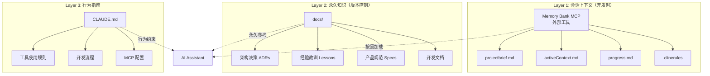
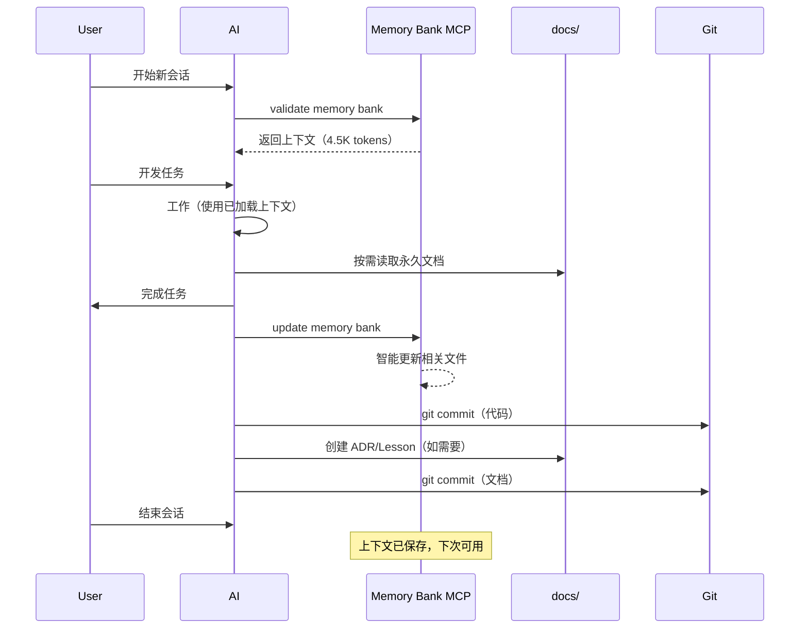

# 文档管理与上下文管理流程 - 最终确认

**Status**: [APPROVED]
**Last Updated**: 2025-11-18
**Purpose**: 确认 EvolvAI 项目的文档和上下文管理标准流程

---

## 🏗️ 三层架构体系



---

## 📋 标准操作流程（SOP）

### 1️⃣ 新会话启动流程

```yaml
触发:
  - 新的 Claude 窗口/会话开始
  - Claude 自动上下文压缩/截断后

步骤:
  1. AI 自动执行:
     命令: "Please validate memory bank for the 'serena' project."
     快捷: /memory-bank-load

  2. Memory Bank MCP 执行:
     - Pre-Flight Validation（文件检查）
     - 分层读取 7 个核心文件
     - 应用 .clinerules 规则
     - 返回压缩后的上下文（~4.5K tokens）

  3. AI 准备就绪:
     - 获得项目上下文
     - 了解当前进展
     - 应用学习的模式

结果: 70-85% token 节省
```

### 2️⃣ 工作过程中的文档查阅

```yaml
触发: 需要详细信息时

原则: 按需查阅，避免全量加载

查阅优先级:
  1. Memory Bank 已加载内容（已在上下文）
  2. docs/ 永久文档（需要时读取）
  3. 源代码文件（最后选择）

示例:
  - 需要 ADR → 读取 docs/development/architecture/adrs/
  - 需要 Lesson → 读取 docs/knowledge/lessons/
  - 需要当前状态 → 已在 activeContext.md（Memory Bank）
```

### 3️⃣ Git Commit 后的自动更新流程

```yaml
触发: 每次 git commit 成功后（自动）

步骤:
  1. AI 立即执行:
     命令: "Please update memory bank for the 'serena' project."
     上下文: "Completed: [commit内容], Git: [branch, commit message]"

  2. Memory Bank MCP 智能更新:
     - 分析 commit 内容
     - 更新 progress.md
     - 更新 activeContext.md（如需要）
     - 识别新模式 → 更新 .clinerules

结果: 自动保持 Memory Bank 与代码同步
```

### 4️⃣ 手动更新流程

```yaml
触发:
  - 完成 Story/Task（无 git commit）
  - 架构决策
  - 用户说 "done" 或 "finished"
  - 用户明确要求更新

步骤:
  1. AI 执行:
     命令: "Please update memory bank for the 'serena' project."
     上下文: "Completed: [what], Decisions: [what], Git: [status]"
     快捷: /memory-bank-update

  2. Memory Bank MCP 智能更新:
     自动决定更新哪些文件:
     - progress.md (always) - 进展状态
     - activeContext.md (if focus changed) - 焦点变化
     - .clinerules (if pattern found) - 新模式
     - 其他文件 (rarely) - 重大变化

  3. 永久知识归档（手动）:
     如果产生了永久价值的知识:
     - ADR → docs/development/architecture/adrs/
     - Lesson → docs/knowledge/lessons/
     - 规范 → docs/product/

结果: 下次会话获得最新上下文
```

### 5️⃣ 永久知识管理流程

```yaml
触发: 产生了长期价值的知识

判断标准:
  ✅ 需要版本控制的:
    - 架构决策（ADR）
    - 经验教训（Lessons）
    - 产品规范（Specs）
    - API 文档

  ❌ 不需要版本控制的:
    - 会话笔记
    - 临时状态
    - 当前焦点
    - 进展追踪

操作:
  1. 创建文档到 docs/ 相应目录
  2. 使用模板（docs/templates/）
  3. Git commit 提交
  4. Memory Bank 不需要包含（太大）

原则: docs/ = 永久 + 版本控制
      Memory Bank = 临时 + 会话级
```

---

## 🔄 完整工作循环



---

## ✅ 核心原则确认

### 文档分层原则

| 层级 | 工具 | 内容类型 | 更新频率 | 版本控制 |
|-----|------|---------|---------|---------|
| **L1 会话** | Memory Bank MCP | 当前状态、进展、焦点 | 高频 | ❌ |
| **L2 永久** | docs/ | ADR、Lessons、Specs | 低频 | ✅ |
| **L3 指南** | CLAUDE.md | AI 行为规则 | 极低 | ✅ |

### 工具定位原则

```yaml
Memory Bank MCP:
  是什么: 外部开发工具（如 Git）
  不是什么: 产品功能
  用途: 管理 AI 会话上下文
  优化: 已优化，不需要 TPST 追踪

Serena MCP:
  状态: 逐步淘汰中
  原因: 上游功能偏移
  Memory: 已废弃，用 Memory Bank 替代
  未来: 被 EvolvAI MCP 替代

EvolvAI MCP:
  定位: 未来的统一平台
  当前: Epic-001 开发中
  目标: 替代 Serena，TPST 优化
```

### 触发时机原则

```yaml
自动加载（validate memory bank）:
  - 新会话窗口 ✅ [自动]
  - 上下文压缩后 ✅ [自动]
  - 切换项目 ✅ [手动]
  - 长时间中断后 ✅ [手动]

自动更新（update memory bank）:
  - 每次 git commit 成功 ✅ [自动]

手动更新（update memory bank）:
  - Story/Task 完成 ✅ [手动]
  - 架构决策 ✅ [手动]
  - 用户说 "done" ✅ [手动]
  - 用户明确要求 ✅ [手动]

注意事项:
  - Git commit 后自动更新，无需手动
  - 临时实验不要 commit，就不会触发更新
  - 探索性工作使用临时分支
```

---

## 📊 效果数据

### Token 使用对比

| 方案 | Token 使用 | 内容 |
|------|-----------|------|
| **传统方式** | 16-23K | CLAUDE.md + docs/ + .serena/memories/ |
| **Memory Bank** | ~4.5K | 7个核心文件 + .clinerules |
| **节省** | 70-85% | 智能加载，按需读取 |

### 文件更新频率

```yaml
高频更新（每天）:
  - progress.md
  - activeContext.md

中频更新（每周）:
  - .clinerules（发现新模式时）
  - productContext.md（问题域调整）

低频更新（每月）:
  - systemPatterns.md（架构决策）
  - techContext.md（技术栈变化）
  - projectbrief.md（目标调整）
```

---

## 🎯 最终确认清单

### 开发者检查项

- [x] Memory Bank MCP 已配置并运行
- [x] 7个标准文件已创建（camelCase命名）
- [x] .clinerules 包含项目特定规则
- [x] slash commands 配置正确（/memory-bank-load, /memory-bank-update）
- [x] CLAUDE.md 已更新，说明清晰
- [x] docs/ 结构符合标准
- [x] 理解三层架构（会话/永久/指南）

### AI Assistant 检查项

- [x] 新会话自动 validate memory bank
- [x] 任务完成自动 update memory bank
- [x] 按需读取 docs/，不全量加载
- [x] 不优化 Memory Bank（它是工具）
- [x] 不使用 Serena memory（已废弃）
- [x] 优先使用 EvolvAI 工具（dogfooding）
- [x] 遵循 CLAUDE.md 行为规则

---

## 📝 总结

**文档管理三原则**：
1. 会话级 → Memory Bank MCP
2. 永久级 → docs/
3. 指南级 → CLAUDE.md

**上下文管理三步骤**：
1. 启动 → validate memory bank
2. 工作 → 按需读取
3. 完成 → update memory bank

**工具使用三层次**：
1. Memory Bank MCP（外部工具）
2. EvolvAI MCP（开发中）
3. Serena MCP（淘汰中）

这就是我们当前的文档和上下文管理标准流程。清晰、高效、可持续。