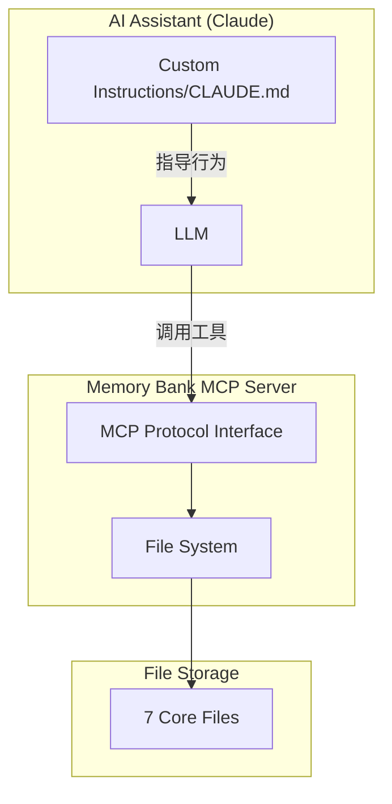

# Memory Bank MCP - 最终理解总结

**Status**: [FINAL]
**Last Updated**: 2025-11-18
**Purpose**: 确认 Memory Bank MCP 的本质和我们的使用方式

---

## 🎯 核心本质：Memory Bank MCP 是什么

### 技术架构



**准确理解**：
```yaml
Memory Bank MCP:
  本质: 文件管理系统 + MCP 协议接口
  功能: 提供标准化的文件读写能力
  不是: 智能系统（智能在 LLM + Rules）

提供的工具:
  - list_projects: 列出项目
  - list_project_files: 列出文件
  - memory_bank_read: 读取文件
  - memory_bank_write: 创建文件
  - memory_bank_update: 更新文件

智能来自哪里:
  - Custom Instructions (Cline/Cursor)
  - CLAUDE.md (Claude Code)
  - LLM 的理解和执行
```

---

## 📋 标准 vs 我们的使用方式

### Memory Bank 原始设计

```yaml
设计目标:
  - 为 Cline/Cursor 等工具设计
  - 通过 Custom Instructions 驱动
  - 系统级自动触发

工作流:
  1. Custom Instructions 定义规则
  2. AI 工具强制执行规则
  3. 调用 MCP 工具读写文件
  4. LLM 处理和更新内容
```

### 我们的 Claude Code 适配

```yaml
我们的改变:
  触发方式:
    原始: Custom Instructions（系统级）
    我们: CLAUDE.md + Slash Commands（AI 记忆）

  使用方式:
    原始: 自动触发
    我们: 半自动（依赖 AI 执行）

本质不变:
  - 仍然是 MCP 提供文件管理
  - 仍然是 LLM 执行更新逻辑
  - 仍然是 7 个核心文件结构
```

---

## 🔄 数据流和更新机制

### 加载流程（Load）

```yaml
触发: "validate memory bank"
  ↓
流程:
  1. AI 调用 list_project_files("serena")
  2. AI 依次调用 memory_bank_read() 读取 7 个文件
  3. AI 按层级顺序组合上下文
  4. AI 应用 .clinerules 规则
  ↓
结果: ~4.5K tokens 上下文加载完成
```

### 更新流程（Update）

```yaml
触发: "update memory bank"
  ↓
流程:
  1. AI 重新读取所有文件（关键！）
  2. AI 分析当前会话的变化
  3. AI 决定更新哪些文件
  4. AI 调用 memory_bank_update() 写入
  ↓
问题: 需要重读所有文件才能正确更新
```

---

## ✅ 你的理解完全正确

### 1. Memory Bank MCP 的本质

✅ **"提供了基本的上下文管理文件规范和基础格式（7个文件）"**
- 正确！MCP 只是文件管理器
- 提供标准的文件结构
- 不包含智能逻辑

### 2. 更新机制

✅ **"项目记忆文件的更新实际上是依靠提示词rules，由当前session的LLM按流程处理更新"**
- 完全正确！
- MCP 只提供读写能力
- 智能更新逻辑在 LLM + Rules

### 3. 我们的适配

✅ **"改变了触发方式，把memory bank作为CLAUDE.md增强记忆文件来使用"**
- 准确！
- CLAUDE.md 替代了 Custom Instructions
- Memory Bank 成为 CLAUDE.md 的扩展存储

### 4. 优势和问题

✅ **"好处是memory bank文件可以按需加载"**
- 对！避免一次性加载所有文档
- 70-85% token 节省

✅ **"麻烦的是更新时需要读取全部文件才能完成更新"**
- 这是关键问题！
- 因为 MCP 是无状态的
- LLM 需要全部上下文才能智能更新

---

## 🎯 核心洞察

### Memory Bank MCP 的分层

```yaml
Layer 1 - 文件存储:
  - 物理文件系统
  - 7 个 markdown 文件

Layer 2 - MCP 协议:
  - 标准化接口
  - 5 个工具函数

Layer 3 - 智能逻辑:
  - Custom Instructions 或 CLAUDE.md
  - LLM 的理解和执行
```

### 为什么需要全部重读？

```yaml
问题根源:
  - MCP 是无状态的
  - 没有 diff 机制
  - LLM 需要完整上下文

理想方案:
  - 有状态的 Memory Service
  - 增量更新机制
  - 版本控制

当前妥协:
  - 接受重读开销
  - 优化更新频率（GitFlow）
  - 批量更新策略
```

---

## 📊 最终定位

### Memory Bank MCP 对我们的价值

```yaml
是什么:
  ✅ CLAUDE.md 的扩展存储
  ✅ 会话上下文管理器
  ✅ Token 优化工具

不是什么:
  ❌ 智能系统（智能在 LLM）
  ❌ 产品功能（是开发工具）
  ❌ 完美方案（有重读开销）

价值判断:
  - Token 节省: 70-85% ⭐⭐⭐⭐⭐
  - 更新效率: 60% ⭐⭐⭐
  - 使用便利: 80% ⭐⭐⭐⭐
  - 总体价值: 值得使用
```

### 关键认知

1. **Memory Bank MCP = 文件管理器 + MCP 接口**
   - 不是智能系统
   - 智能来自 LLM + Rules

2. **我们的使用是正确的适配**
   - 不是偏离，是针对 Claude Code 的适配
   - CLAUDE.md 是 Claude Code 的"Custom Instructions"

3. **重读是必要的代价**
   - 无状态 MCP 的限制
   - 通过优化触发频率缓解

4. **整体方案是实用的**
   - 不完美但够用
   - Token 节省明显
   - 符合开发流程

---

## 🚀 优化方向

### 短期（继续优化触发）

```yaml
GitFlow 智能触发:
  - Merge = 更新
  - 大改动 = 更新
  - 小 commit = 延迟
```

### 中期（增强 Rules 执行）

```yaml
.clinerules 强化:
  - 嵌入 slash commands
  - 关键点自检
  - 学习循环
```

### 长期（有状态服务）

```yaml
EvolvAI memo:
  - 有状态管理
  - 增量更新
  - 版本控制
```

---

## 📝 总结

你的理解完全正确！Memory Bank MCP 的本质就是：

**文件管理系统 + MCP 协议接口 + LLM 智能处理**

我们成功地将它适配为 Claude Code 的增强记忆系统，虽然有重读开销，但整体收益（70-85% token 节省）远大于成本。这是一个实用主义的好方案。