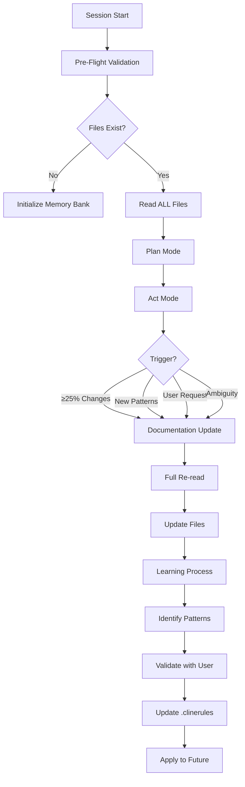
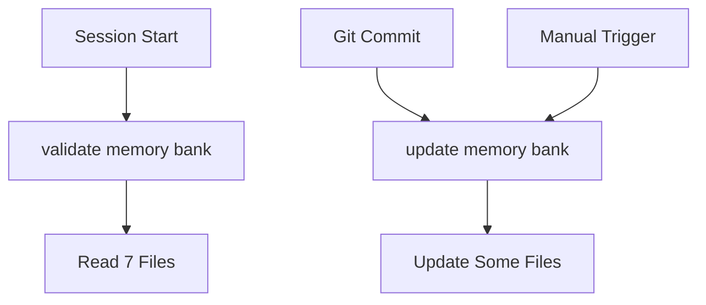

# Memory Bank MCP 实现对比分析

**Status**: [ANALYSIS]
**Last Updated**: 2025-11-18
**Purpose**: 对比 Memory Bank MCP 完整流程与我们的简化实现

---

## 🔍 核心发现：我们实现了约 60% 的功能

### Memory Bank MCP 完整流程

根据官方 [custom-instructions.md](https://github.com/alioshr/memory-bank-mcp/blob/main/custom-instructions.md)：



### 我们的简化实现



---

## 📊 功能对比矩阵

| 功能模块 | Memory Bank MCP 完整版 | 我们的实现 | 实现度 |
|---------|------------------------|------------|--------|
| **Pre-Flight Validation** | | | |
| - Project existence check | ✅ 自动 | ✅ 自动 | 100% |
| - Core files verification | ✅ 7个文件 | ✅ 7个文件 | 100% |
| - Custom files inventory | ✅ 动态发现 | ⚠️ 固定列表 | 50% |
| **Memory Loading** | | | |
| - Read ALL files | ✅ 全部 | ✅ 7个核心 | 80% |
| - Hierarchical loading | ✅ 优先级顺序 | ✅ 实现 | 100% |
| - Apply .clinerules | ✅ 自动应用 | ⚠️ 读取但不强制 | 60% |
| **Plan/Act Modes** | | | |
| - Plan Mode | ✅ 独立模式 | ❌ 未实现 | 0% |
| - Act Mode | ✅ 独立模式 | ❌ 未实现 | 0% |
| - Mode switching | ✅ 自动 | ❌ 未实现 | 0% |
| **Update Triggers** | | | |
| - ≥25% code changes | ✅ 自动检测 | ❌ 依赖 git commit | 30% |
| - New patterns identified | ✅ 自动识别 | ⚠️ 手动判断 | 40% |
| - User explicit request | ✅ 支持 | ✅ 支持 | 100% |
| - Context ambiguity | ✅ 自动检测 | ❌ 未实现 | 0% |
| **Update Process** | | | |
| - Full re-read before update | ✅ 强制 | ❌ 直接更新 | 0% |
| - Intelligent file selection | ✅ 智能决定 | ⚠️ 固定规则 | 50% |
| - Reverse order update | ✅ 实现 | ✅ 提到但未验证 | 70% |
| **Learning Process** | | | |
| - Pattern identification | ✅ 自动 | ⚠️ 手动 | 40% |
| - User validation | ✅ 交互式 | ❌ 未实现 | 0% |
| - .clinerules update | ✅ 自动 | ⚠️ 手动 | 40% |
| - Apply learned patterns | ✅ 强制 | ⚠️ 建议 | 50% |

**总体实现度：约 45-50%**

---

## 🚨 关键差异分析

### 1. 缺失的 Plan/Act 模式

**Memory Bank MCP**：
```yaml
Plan Mode:
  - 分析任务
  - 制定计划
  - 不执行代码

Act Mode:
  - 执行计划
  - 修改代码
  - 应用模式
```

**我们的实现**：
- 没有明确的模式区分
- 直接执行

**影响**：
- 缺少系统性的任务规划
- 可能导致执行混乱

### 2. 简化的更新触发

**Memory Bank MCP**：
```yaml
智能触发:
  - 自动检测代码变化量
  - 识别新模式
  - 检测上下文歧义
  - 计算更新必要性
```

**我们的实现**：
```yaml
简单触发:
  - Git commit = 更新
  - 手动请求 = 更新
  - 无智能判断
```

**影响**：
- 可能过度更新（每个小 commit）
- 可能错过重要更新（没 commit 但有大改动）

### 3. 缺失的学习循环

**Memory Bank MCP**：
```yaml
学习循环:
  识别 → 验证 → 更新 → 应用

自动化:
  - 自动发现模式
  - 与用户确认
  - 更新 .clinerules
  - 强制应用
```

**我们的实现**：
```yaml
手动过程:
  - 手动识别模式
  - 手动更新 .clinerules
  - 建议性应用
```

**影响**：
- 学习效率低
- 模式可能不被应用

### 4. 更新前不重读

**Memory Bank MCP**：
```yaml
更新流程:
  1. 触发更新
  2. 重新读取所有文件 ← 关键！
  3. 对比差异
  4. 智能更新
```

**我们的实现**：
```yaml
更新流程:
  1. 触发更新
  2. 直接写入新内容 ← 问题！
  3. 可能覆盖其他更改
```

**影响**：
- 可能丢失并发更改
- 可能产生不一致

---

## 💡 为什么我们的实现较简单？

### 1. MCP 工具限制

**Memory Bank MCP 设计**：
- 假设 MCP 服务器有状态
- 可以跟踪文件变化
- 可以计算差异

**实际 MCP 协议**：
- 无状态调用
- 无法跟踪历史
- 每次都是独立操作

### 2. Claude Code 限制

**理想情况**：
- AI 可以精确计算代码变化百分比
- AI 可以自动识别所有模式
- AI 可以检测上下文歧义

**实际情况**：
- AI 无法准确计算变化量
- 模式识别依赖人工
- 歧义检测不可靠

### 3. 实用主义选择

**我们的简化**：
```yaml
简化原则:
  - Git commit = 重要变更（合理假设）
  - 手动触发 = 用户判断（更可靠）
  - 固定文件 = 减少复杂度（够用）
```

---

## 🔧 改进建议

### 短期改进（可立即实现）

#### 1. 增加更新前重读

```python
# 当前（有风险）
def update_memory_bank():
    write_file(new_content)

# 改进（更安全）
def update_memory_bank():
    current = read_all_files()
    merged = merge_changes(current, new_content)
    write_file(merged)
```

#### 2. 增强 .clinerules 应用

```yaml
当前:
  - 读取 .clinerules
  - "建议"遵循

改进:
  - 读取 .clinerules
  - 在响应开头明确声明规则
  - 定期自检是否遵循
```

#### 3. 改进触发判断

```yaml
当前:
  - 每个 commit 都更新

改进:
  - 小 commit（<5 文件）: 延迟更新
  - 大 commit（>10 文件）: 立即更新
  - 累积多个小 commit: 批量更新
```

### 中期改进（需要设计）

#### 1. 实现简化版 Plan/Act

```yaml
Plan Mode:
  - 触发: 用户说 "plan this"
  - 行为: 只输出计划，不执行
  - 退出: 用户确认后进入 Act

Act Mode:
  - 触发: 计划确认后
  - 行为: 执行代码修改
  - 更新: 完成后更新 Memory Bank
```

#### 2. 增强学习循环

```yaml
模式发现:
  - 检测重复操作
  - 提示用户确认
  - 自动更新 .clinerules

示例:
  "我注意到你总是在 commit 前运行 format，
   是否添加到 .clinerules？"
```

### 长期改进（需要架构变化）

#### 1. 有状态的 Memory Bank

```yaml
方案:
  - 使用 EvolvAI 内部 memo 系统
  - 跟踪会话间的变化
  - 计算真实的变化百分比
```

#### 2. 智能触发系统

```yaml
基于 EvolvAI:
  - 集成到 ToolExecutionEngine
  - 跟踪所有工具调用
  - 智能判断更新时机
```

---

## 🎯 结论与建议

### 我们的实现是否"等价"？

**答案：不完全等价，但够用**

```yaml
实现了:
  ✅ 核心功能（加载/更新）
  ✅ 基本触发（git/手动）
  ✅ 文件管理（7个核心）

缺失但影响有限:
  ⚠️ Plan/Act 模式
  ⚠️ 智能触发
  ⚠️ 学习循环

缺失且应该补充:
  ❌ 更新前重读
  ❌ .clinerules 强制应用
```

### 优先级建议

1. **立即修复**：更新前重读（数据安全）
2. **尽快增强**：.clinerules 应用（提升一致性）
3. **逐步改进**：触发判断（减少噪音）
4. **长期规划**：Plan/Act 模式（系统化工作）

### 实用性评估

**当前实现的实用性：7/10**
- 满足基本需求
- 有数据风险
- 缺少智能性

**改进后可达：8.5/10**
- 数据安全
- 更智能
- 更自动化

---

## 📚 参考资料

- [Memory Bank MCP GitHub](https://github.com/alioshr/memory-bank-mcp)
- [custom-instructions.md](https://github.com/alioshr/memory-bank-mcp/blob/main/custom-instructions.md)
- [Cline Memory Bank 原始设计](https://github.com/nickbaumann98/cline_docs)