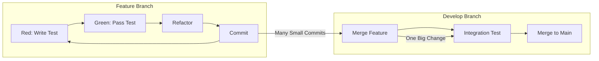

# Memory Bank 精炼策略 - GitFlow + TDD 视角

**Status**: [ACTIVE]
**Last Updated**: 2025-11-18
**Purpose**: 基于 GitFlow + TDD/BDD 工作流重新设计 Memory Bank 策略

---

## 🎯 核心洞察：GitFlow 天然过滤了噪音

### GitFlow + TDD 工作流下的提交模式



**关键认知**：
```yaml
Feature Branch 期间:
  - 大量小 commits (每个 test cycle)
  - 都是增量改动
  - 不需要每次都更新 Memory Bank

真正需要更新的时机:
  1. Feature → Develop 合并（完成功能）
  2. 单个大 commit（重构/大改）
  3. 完成 Story/Task（里程碑）
  4. 切换工作焦点（context switch）
```

### 智能触发策略

```yaml
不更新（噪音）:
  - feat: add test for X
  - fix: make test pass
  - refactor: extract method
  - style: format code

更新（信号）:
  - Merge branch 'feature/*'
  - 10+ files changed
  - Story X.X complete
  - Major refactoring
```

---

## 📋 .clinerules 的真正定位

### 什么是 .clinerules？

**.clinerules = 项目特定的 AI 行为规则**

```yaml
不是:
  - 通用开发规范（那是 docs/）
  - 代码风格指南（那是 .editorconfig）
  - 项目配置（那是 config files）

而是:
  - AI 助手的行为偏好
  - 项目特定的工作模式
  - 从实践中学到的模式
  - 避免重复错误的规则
```

### .clinerules 应该包含什么？

```markdown
# EvolvAI Project Rules

## Critical Implementation Paths
- ALWAYS check Story TDD Plan before writing code
- NEVER skip Red phase in TDD cycle
- Map every test to DoD standard

## Tool Preferences
- Use EvolvAI safe_* tools over Serena tools
- Use batch_edit for multi-file changes
- Use safe_exec with timeout for tests

## Common Pitfalls to Avoid
- Don't test fixtures just because they exist
- Don't over-engineer beyond Story requirements
- Don't modify test interfaces without updating tests

## Project-Specific Patterns
- Python: use `uv run poe` not `python`
- Git: feature/* → develop → main flow
- Tests: pytest with -xvs flags

## Learned Behaviors
- After format failure: run `uv run poe format`
- After type error: check `uv run poe type-check`
- Large refactor: create ADR first
```

### 如何执行 .clinerules？

**当前问题**：
```yaml
现在:
  - 读取 .clinerules（在 Memory Bank 加载时）
  - "希望" AI 记住并遵循
  - 没有强制机制

问题:
  - AI 可能忘记
  - 规则可能被忽略
  - 没有自检机制
```

**改进方案**：

#### 方案 1：嵌入 Slash Commands（你的建议✅）

```markdown
# /memory-bank-load

执行加载后，立即声明：
"我已加载项目规则 (.clinerules)，将严格遵循：
1. TDD: 总是先写测试
2. Tools: 优先 safe_* 工具
3. Git: feature → develop 流程
..."

# /memory-bank-update

更新时检查：
"本次会话发现的新模式：
- 模式：总是在 X 之前做 Y
- 是否加入 .clinerules？[待确认]"
```

#### 方案 2：创建执行检查点

```yaml
关键时刻自检:
  - Before writing code: "是否查看了 Story TDD Plan？"
  - Before commit: "是否运行了测试？"
  - Using tools: "是否用了 safe_* 版本？"

实现方式:
  - 在 CLAUDE.md 中定义检查点
  - AI 在这些时刻自问自答
```

#### 方案 3：Pattern Matching

```python
# 伪代码
def before_action(action):
    rules = load_clinerules()
    for rule in rules:
        if rule.matches(action):
            apply_rule(rule)

示例:
  Action: "使用 grep 搜索"
  Rule: "Use safe_search instead of grep"
  Result: 自动替换为 safe_search
```

---

## 🔄 Plan/Act 模式的实际价值

### Plan 模式

**定义**：只分析和规划，不执行任何代码修改

```yaml
触发:
  - 用户: "plan how to implement X"
  - 复杂任务开始前
  - 不确定如何处理时

行为:
  - ✅ 读取和分析代码
  - ✅ 制定实施计划
  - ✅ 识别风险和依赖
  - ❌ 不修改任何文件
  - ❌ 不执行命令

输出:
  1. 任务分解
  2. 执行顺序
  3. 风险提示
  4. 需要的工具
```

**实际价值**：
```yaml
避免问题:
  - 防止盲目修改
  - 减少试错成本
  - 提前发现阻塞

提高效率:
  - 用户可以审查计划
  - 可以调整方向
  - 避免返工
```

### Act 模式

**定义**：执行计划，修改代码

```yaml
触发:
  - 用户确认计划
  - 简单明确的任务
  - 明确知道做什么

行为:
  - ✅ 修改文件
  - ✅ 执行命令
  - ✅ 运行测试
  - ✅ 提交代码

输出:
  - 实际的代码改动
  - 测试结果
  - Git commits
```

### Claude Code 中如何实现？

**简化版 Plan/Act**：

```markdown
## Plan 模式触发词
- "plan this"
- "how would you"
- "analyze first"
- "don't execute"

## Act 模式触发词
- "implement this"
- "do it"
- "execute the plan"
- "make the changes"

## 模式切换
User: "Plan how to add authentication"
AI: [Plan Mode]
    1. 分析现有代码...
    2. 制定计划...
    3. "Ready to execute? Say 'do it'"

User: "Do it"
AI: [Act Mode]
    执行上述计划...
```

---

## 🚀 精炼后的 Memory Bank 策略

### 1. 更新触发策略（基于 GitFlow）

```yaml
自动更新:
  - Merge commits（功能完成）
  - 10+ files changed（大改动）
  - Story completion（里程碑）

延迟更新:
  - Feature branch 小 commits
  - Style/format changes
  - Test-only changes

批量更新:
  - 积累 5+ 小 commits
  - End of work session
  - Branch completion
```

### 2. .clinerules 执行策略

```yaml
强制点:
  1. Load 时声明规则
  2. 关键决策前自检
  3. Update 时学习新规则

存储位置:
  - 规则定义: .clinerules 文件
  - 执行逻辑: slash commands
  - 检查点: CLAUDE.md

更新机制:
  - 发现模式 → 提议规则 → 用户确认 → 写入文件
```

### 3. Plan/Act 实用化

```yaml
不需要:
  - 复杂的模式系统
  - 状态管理
  - 强制分离

只需要:
  - 触发词识别
  - 行为区分
  - 用户可以说 "plan first" 或 "just do it"
```

---

## 📊 实施建议

### 立即可做

1. **修改更新触发判断**
```python
def should_update_memory_bank(git_status):
    if "Merge branch" in git_status:
        return True  # 功能完成
    if files_changed > 10:
        return True  # 大改动
    if "Story" in commit_message:
        return True  # 里程碑
    return False  # 延迟更新
```

2. **增强 .clinerules 执行**
```markdown
/memory-bank-load 执行后：
"已加载项目规则，本次会话将：
- 严格遵循 TDD (Red-Green-Refactor)
- 使用 safe_* 工具优先
- 遵循 GitFlow 分支策略"
```

3. **简单 Plan/Act 识别**
```python
if "plan" in user_message.lower():
    enter_plan_mode()
    print("进入规划模式，不会修改代码")
elif "do it" in user_message.lower():
    enter_act_mode()
    print("执行模式，开始修改代码")
```

### 中期改进

1. **智能 commit 分析**
   - 分析 commit message
   - 识别 PR 模式
   - 自动分类重要性

2. **规则学习循环**
   - 跟踪重复操作
   - 提议新规则
   - 用户确认后自动加入

3. **模式状态提示**
   - UI 显示当前模式
   - 明确行为边界
   - 用户可随时切换

---

## 🎯 核心结论

1. **GitFlow + TDD 天然提供了正确的更新时机**
   - 不需要每个 commit 都更新
   - Merge 和 Story 完成是关键信号

2. **.clinerules 应该嵌入执行流程**
   - 不只是被动读取
   - 需要主动声明和检查
   - Slash commands 是好的执行点

3. **Plan/Act 的价值在于选择权**
   - 不需要复杂实现
   - 用户可以选择 "先规划" 或 "直接做"
   - 简单的触发词识别就够了

4. **实用主义优于完美主义**
   - 50% 的实现但 100% 可靠
   - 比 100% 的实现但 50% 可靠更好