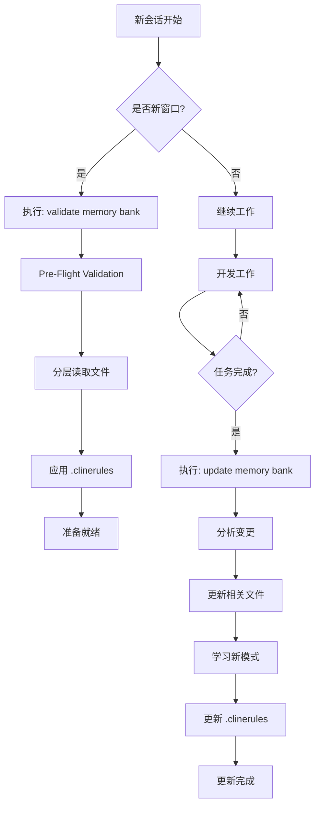

# Memory Bank MCP 工作流程与触发机制

**Status**: [ACTIVE]
**Last Updated**: 2025-11-18
**Purpose**: 定义 Memory Bank MCP 在 EvolvAI 项目开发中的正确使用方式

---

## 📌 核心定位

**Memory Bank MCP 是什么**：
- ✅ **开发工具**：类似 Git，用于管理项目上下文
- ✅ **外部服务**：通过 MCP 协议提供的独立服务
- ✅ **会话管理**：跨会话保持项目状态和学习模式

**Memory Bank MCP 不是什么**：
- ❌ **不是 EvolvAI 产品功能**：它是用来开发 EvolvAI 的工具
- ❌ **不需要集成到项目中**：它在项目外部运行
- ❌ **不需要 TPST 优化**：它已经是优化后的工具

---

## 🔄 工作流程图



---

## 🚀 触发机制

### 1. 加载触发（Load Triggers）

**自动触发时机**：
- 🔵 **新会话窗口启动**
  ```
  命令: "Please validate memory bank for the 'serena' project."
  快捷: /memory-bank-load
  ```

**手动触发时机**：
- 切换到不同项目
- 长时间休息后返回
- 需要刷新上下文时

**执行流程**：
1. Pre-Flight Validation（检查文件存在）
2. 分层读取（projectbrief → productContext → systemPatterns → techContext → activeContext → progress → .clinerules）
3. 应用项目规则（.clinerules）
4. 返回完整上下文

---

### 2. 更新触发（Update Triggers）

**自动触发条件**（满足任一）：
- ✅ **代码变更 ≥25%**：大量代码修改后
- ✅ **新模式发现**：识别到新的开发模式
- ✅ **用户请求**：用户说"done"或"finished"
- ✅ **上下文歧义**：当前状态不明确

**手动触发时机**：
- 🔵 **Git 提交后**（重要变更）
  ```
  命令: "Please update memory bank for the 'serena' project."
  快捷: /memory-bank-update
  ```
- 完成 Story/Task
- 做出架构决策
- 项目焦点改变
- 结束工作会话前

**执行流程**：
1. 分析当前状态（Git、todos、会话历史）
2. 确定需要更新的文件
3. 逆序更新（progress → activeContext → 其他）
4. 识别新模式 → 更新 .clinerules
5. 报告更新内容

---

## 📁 文件结构与更新策略

### 标准文件层级

```yaml
Purple (Foundation - 静态):
  projectbrief.md: 项目核心需求和目标

Blue (Context - 偶尔更新):
  productContext.md: 问题/解决方案上下文
  systemPatterns.md: 架构模式、ADR
  techContext.md: 技术栈、命令

Green (Active - 频繁更新):
  activeContext.md: 当前焦点、近期决策
  progress.md: 开发状态、路线图

Yellow (Rules - 持续学习):
  .clinerules: 项目特定规则和模式
```

### 更新频率矩阵

| 文件 | 更新频率 | 触发条件 |
|------|---------|---------|
| projectbrief.md | 极少 | 项目目标改变 |
| productContext.md | 偶尔 | 问题域改变 |
| systemPatterns.md | 偶尔 | 新架构决策 |
| techContext.md | 偶尔 | 技术栈改变 |
| activeContext.md | 频繁 | 焦点改变、新决策 |
| progress.md | 频繁 | 任务完成、状态变化 |
| .clinerules | 持续 | 新模式发现 |

---

## 🎯 使用原则

### DO - 正确做法

✅ **按需加载**：
```bash
# 新会话
"Please validate memory bank for the 'serena' project."
```

✅ **适时更新**：
```bash
# 任务完成后
"Please update memory bank for the 'serena' project.
Context: Completed Story 2.2, standardized Memory Bank usage"
```

✅ **使用快捷命令**：
- `/memory-bank-load` - UI 便利层
- `/memory-bank-update` - UI 便利层

✅ **让 Memory Bank MCP 处理逻辑**：
- 不要手动生成文件内容
- 不要实现自定义加载/更新逻辑
- 信任 Memory Bank 的智能分发

### DON'T - 错误做法

❌ **过度更新**：
- 每个小改动都更新
- 临时实验也更新
- 探索性工作也更新

❌ **重复造轮子**：
- 创建自定义 MemoryBankAgent
- 实现自己的加载逻辑
- 追踪 Memory Bank 的 TPST

❌ **混淆定位**：
- 把 Memory Bank 当作产品功能
- 试图优化 Memory Bank 本身
- 将其集成到项目代码中

---

## 📊 Token 优化效果

**传统方式**（读取所有文档）：
- CLAUDE.md: ~8K tokens
- docs/: ~10K tokens
- memories/: ~5K tokens
- **总计**: 16-23K tokens

**Memory Bank MCP 方式**：
- 按需加载: ~4.5K tokens
- 智能分层: 只读必要内容
- .clinerules: 应用学习模式
- **节省**: 70-85% tokens

---

## 🔧 配置检查清单

### Claude Desktop/Code 配置

```json
{
  "allPepper-memory-bank": {
    "type": "stdio",
    "command": "npx",
    "args": ["-y", "@allpepper/memory-bank-mcp@latest"],
    "env": {
      "MEMORY_BANK_ROOT": "/path/to/memory-bank"
    }
  }
}
```

### 文件存在性检查

```bash
# 检查 Memory Bank 根目录
ls $MEMORY_BANK_ROOT/serena/

# 应该包含：
# - projectbrief.md
# - productContext.md
# - systemPatterns.md
# - techContext.md
# - activeContext.md
# - progress.md
# - .clinerules
```

### Slash Commands 配置

```bash
# 检查命令文件
ls ~/.claude/commands/memory-bank-*.md

# 应该包含：
# - memory-bank-load.md (调用 "validate memory bank")
# - memory-bank-update.md (调用 "update memory bank")
```

---

## 🚨 常见问题

### Q1: Memory Bank 文件应该版本控制吗？

**A**: 不需要。Memory Bank 是会话级别的上下文管理，不是项目代码的一部分。永久知识应该在 `docs/` 目录下版本控制。

### Q2: Memory Bank 和 Serena Memory 有什么区别？

| 特性 | Memory Bank MCP | Serena Memory |
|-----|----------------|--------------|
| 定位 | 开发工具（外部） | 项目功能（内部） |
| 协议 | 标准 MCP | 自定义工具 |
| 优化 | 已优化 | 未优化 |
| 用途 | 会话上下文 | 项目知识（废弃） |

### Q3: 什么时候不应该更新 Memory Bank？

- ❌ 临时实验
- ❌ 探索性代码
- ❌ 每个小的 git commit
- ❌ 未完成的工作

### Q4: Memory Bank 更新失败怎么办？

1. 检查文件权限
2. 验证 MCP 服务运行状态
3. 手动检查文件内容
4. 重新初始化项目

---

## 📚 相关文档

- [CLAUDE.md](/Users/dreamlinx/Dropbox/Projects/opensource/serena/CLAUDE.md) - 项目 AI 行为指南
- [Memory Bank GitHub](https://github.com/alioshr/memory-bank-mcp) - 官方文档
- `/memory-bank-load` - Slash command 定义
- `/memory-bank-update` - Slash command 定义

---

## 🎯 核心要点总结

1. **Memory Bank MCP = 开发工具**，不是产品功能
2. **使用标准命令**，不要重新实现
3. **按需更新**，不要过度使用
4. **永久知识在 docs/**，会话上下文在 Memory Bank
5. **让 Memory Bank 处理智能逻辑**，我们只调用

记住：Memory Bank MCP 是帮助我们开发 EvolvAI 的工具，就像 Git 帮助我们管理代码一样。不要试图优化它或集成它，只需正确使用它。