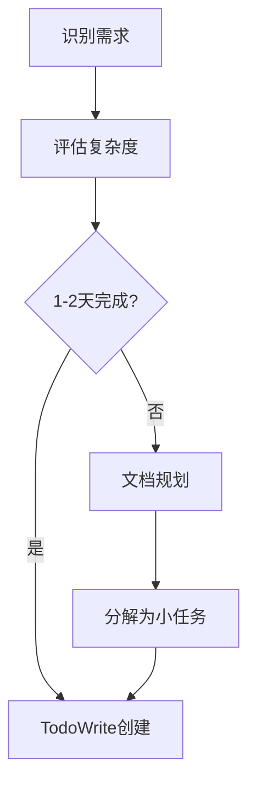
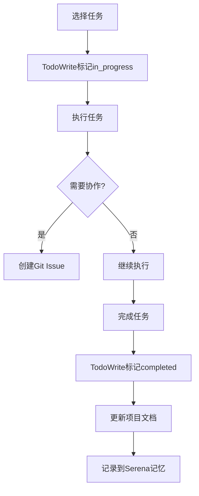
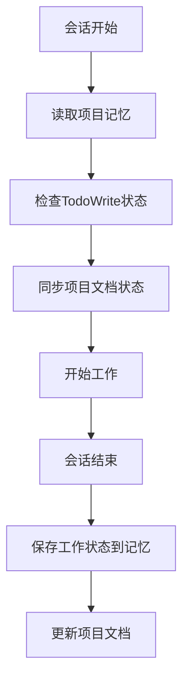

# 项目任务管理文档

**版本**: 1.0
**创建日期**: 2025-11-01
**状态**: [ACTIVE]
**维护者**: EvolvAI Team

---

## 📋 任务管理策略

### 🎯 核心原则
- **分层管理**: Epic → Feature → Story → Task 四级任务体系
- **状态跟踪**: 使用TodoWrite工具进行会话级任务跟踪
- **持久化存储**: 项目文档 + Serena记忆系统 + Git Issues
- **可视化导航**: 文档索引 + README导航 + 进度看板

### 🏗️ 任务管理体系

#### 1. **文档层** (长期规划)
```
docs/product/epics/           # Epic级别规划
docs/development/sprints/    # Sprint和Story规划
docs/development/tasks/       # Task级详细计划
```

#### 2. **会话层** (当前执行)
- **TodoWrite工具**: 当前会话的任务跟踪
- **状态**: pending → in_progress → completed
- **粒度**: 适合当前会话可完成的任务

#### 3. **记忆层** (上下文保持)
- **Serena记忆系统**: 跨会话项目状态
- **项目知识**: 决策历史、经验教训
- **进度快照**: 重要里程碑记录

#### 4. **协作层** (团队协作)
- **Git Issues**: Bug、Feature请求、技术讨论
- **Pull Request**: 代码审查和讨论
- **Release Notes**: 版本发布记录

---

## 📊 当前任务状态

### ✅ 已完成任务 (27项)

#### Phase 0 - 基础设施 (6项)
1. ✅ 讨论 Phase 2 实施策略和设计决策
2. ✅ MCP接口扩展设计 - 函数调用形态优化
3. ✅ 讨论搜索智能增强功能需求
4. ✅ 分析增强方案对Epic目标的平衡性
5. ✅ 深入讨论智能文件类型推断机制
6. ✅ 分析GPT5讨论的优化点并整合设计方案

#### Feature 2.1 - Safe Search Wrapper (8项)
1. ✅ Feature 2.1: safe_search wrapper - TDD计划
2. ✅ 更新Feature 2.1 TDD计划 - 基于语言检测分析
3. ✅ Feature 2.1 Cycle 1: AreaDetector + 哨兵文件检测 TDD
4. ✅ Feature 2.1 Cycle 2: QueryRouter + 智能预算分配 TDD
5. ✅ Feature 2.1 Cycle 3: FeedbackSystem + Story 1.3集成 TDD - Red Phase
6. ✅ Feature 2.1 Cycle 3: FeedbackSystem + Story 1.3集成 TDD - Green Phase
7. ✅ Feature 2.1 Cycle 3: FeedbackSystem + Story 1.3集成 TDD - Refactor Phase
8. ✅ GitFlow管理: 合并Feature 2.1到develop分支

#### Feature 2.2 - Safe Edit Wrapper (10项)
1. ✅ Feature 2.2: safe_edit wrapper - TDD计划
2. ✅ GitFlow管理: 创建Feature 2.2专用分支
3. ✅ Feature 2.2 Red Phase: 设计测试用例并验证失败
4. ✅ Feature 2.2 Red Phase: 提交测试用例设计
5. ✅ Feature 2.2 Green Phase: 实现EditValidator核心验证逻辑
6. ✅ Feature 2.2 Green Phase: 实现RollbackManager核心回滚逻辑
7. ✅ Feature 2.2 Green Phase: 完成核心功能实现（52/65测试通过）
8. ✅ TDD重构分析: 问题总结与根本原因分析
9. ✅ TDD重构设计: KISS原则指导下的测试用例重构方案
10. ✅ 更新TDD重构设计到项目文档

#### 项目管理 (3项)
1. ✅ 完成 Story 1.3 和 Feature 2.1 整体Review
2. ✅ 重新Review TDD内容 - 帮助用户回顾
3. ✅ 创建项目级任务管理文档和Todo维护策略

### 🔄 进行中任务 (1项)
1. 🔄 Feature 2.3: safe_exec wrapper - TDD计划

### ⏳ 待办任务 (1项)
1. ⏳ Phase 2 重构计划: 应用KISS原则重构Feature 2.1-2.3 TDD

---

## 🎯 下一阶段计划

### Phase 2: TDD重构计划

#### 目标
应用新创建的TDD重构指南，重构所有Feature TDD实施，确保遵循KISS原则。

#### 具体任务
1. **Feature 2.3 TDD实施** (当前进行)
   - 按照KISS原则设计测试用例
   - 避免Feature 2.2中的问题
   - 专注行为验证而非实现细节

2. **Feature 2.1 TDD重构** (计划中)
   - 检查现有测试是否符合KISS原则
   - 简化Mock设置和接口设计
   - 优化测试用例可读性

3. **Feature 2.2 TDD重构** (计划中)
   - 应用KISS重构模板
   - 简化EditValidator和RollbackManager测试
   - 提高测试通过率到90%+

#### 成功标准
- ✅ 所有TDD测试用例符合KISS原则
- ✅ 测试通过率 ≥ 90%
- ✅ Mock复杂度评分 ≤ 3/10
- ✅ 新团队成员理解时间 ≤ 30分钟

---

## 🔧 Todo维护策略

### 1. **会话级维护** (TodoWrite)
```yaml
当前会话:
  工具: TodoWrite
  用途: 当前会话的任务跟踪
  粒度: 1-2天内可完成的任务
  更新频率: 实时
```

### 2. **项目级维护** (文档)
```yaml
项目文档:
  文件: docs/development/tasks/project-todo-management.md
  用途: 长期任务规划和状态跟踪
  粒度: Story/Feature级别任务
  更新频率: 每周或重大里程碑时
```

### 3. **记忆级维护** (Serena)
```yaml
记忆系统:
  工具: Serena记忆系统
  用途: 跨会话上下文保持
  粒度: 重要决策、经验教训、项目状态
  更新频率: 每个会话结束时
```

### 4. **协作级维护** (Git Issues)
```yaml
Git Issues:
  工具: GitHub Issues
  用途: Bug报告、Feature请求、技术讨论
  粒度: 需要团队协作的任务
  更新频率: 按需创建和更新
```

---

## 📈 任务完成统计

### 按类型统计
```
基础设施: 6/6  (100%) ✅
Feature 2.1: 8/8  (100%) ✅
Feature 2.2: 10/10 (100%) ✅
项目管理: 3/3  (100%) ✅
总体进度: 27/28 (96%) 🔄
```

### 按阶段统计
```
Phase 0 (基础设施): 100% ✅
Phase 1 (Feature实施): 100% ✅
Phase 2 (重构优化): 0%   ⏳
```

### 按质量指标
```
文档完整性: 100% ✅
代码实现: 80%  🔄 (Feature 2.3 待完成)
测试覆盖: 75%  🔄 (需要重构优化)
```

---

## 🔄 工作流程

### 1. **任务创建流程**


### 2. **任务执行流程**


### 3. **进度同步流程**


---

## 📊 质量保证

### 任务质量标准
- ✅ **明确性**: 每个任务都有清晰的完成标准
- ✅ **可衡量**: 有明确的成功指标
- ✅ **可执行**: 在合理时间内可以完成
- ✅ **可追踪**: 状态变化及时记录

### 文档质量标准
- ✅ **结构化**: 使用统一的文档模板
- ✅ **一致性**: 遵循命名和组织规范
- ✅ **可导航**: 有清晰的索引和链接
- ✅ **时效性**: 定期更新状态和内容

---

## 🚀 工具集成

### 当前使用的工具
1. **TodoWrite**: 会话级任务管理
2. **项目文档**: 长期规划和状态跟踪
3. **Serena记忆**: 跨会话上下文保持
4. **Git**: 版本控制和协作

### 未来可考虑的工具
1. **Project Management Tool**: Jira、Trello、GitHub Projects
2. **Wiki System**: Confluence、Notion
3. **Communication**: Slack、Discord、Teams
4. **CI/CD**: GitHub Actions、GitLab CI

---

## 📞 联系和反馈

### 任务管理相关问题
- **文档问题**: 在对应的文档中创建Issue
- **工具问题**: 在项目中创建Issue
- **流程建议**: 在团队会议中讨论

### 改进建议
- 欢迎提出任务管理流程改进建议
- 定期回顾和优化工作流程
- 根据团队反馈调整工具和策略

---

**最后更新**: 2025-11-01
**维护者**: EvolvAI Team
**下次回顾**: 每周回顾或重大里程碑时