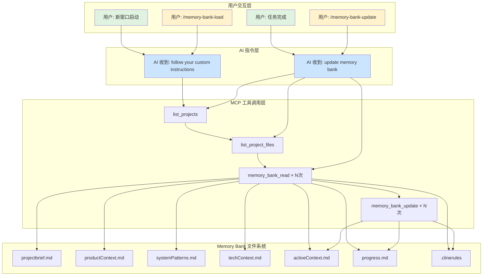

# Memory Bank MCP 触发机制和工作流程

**最后更新**: 2025-11-18
**状态**: [ACTIVE]

---

## 🎯 核心理解

Memory Bank MCP 有两层工作机制：

1. **MCP 工具层** - 底层的实际工具调用（memory_bank_read, memory_bank_write 等）
2. **AI 指令层** - 高级命令（"follow your custom instructions" 等），AI 收到后会智能调用多个 MCP 工具

---

## 📊 完整工作流程



---

## 🔄 触发机制详解

### 1. 新窗口启动（Session Start）

**触发条件**：
- 新的 Claude/Cursor 会话开始
- 切换到新项目
- 长时间休息后返回

**执行流程**：
```
1. AI 执行: "follow your custom instructions"
2. Memory Bank MCP 内部流程:
   a. Pre-Flight Validation
      - list_projects → 确认 "serena" 项目存在
      - list_project_files → 检查核心文件
   b. Hierarchical File Loading
      - memory_bank_read("projectbrief.md") → 基础信息
      - memory_bank_read("productContext.md") → 问题域
      - memory_bank_read("systemPatterns.md") → 架构
      - memory_bank_read("techContext.md") → 技术栈
      - memory_bank_read("activeContext.md") → 当前焦点
      - memory_bank_read("progress.md") → 进度状态
      - memory_bank_read(".clinerules") → 项目规则
   c. Apply Patterns
      - 应用 .clinerules 中的模式
3. AI 准备就绪，context 已加载
```

**Token 优化**：16-23K → ~4.5K（70% 减少）

### 2. 任务完成更新（Task Completion）

**触发条件**：
- ✅ 完成 Story/Task
- ✅ Git commit（重要变更）
- ✅ 架构决策完成
- ✅ 用户说 "done" / "finished"
- ✅ 项目焦点改变

**执行流程**：
```
1. AI 执行: "update memory bank"
2. Memory Bank MCP 内部流程:
   a. 检测更新触发器
      - ≥25% 代码变更
      - 新模式发现
      - 用户显式请求
      - 上下文模糊需要澄清
   b. 重新读取所有文件
      - memory_bank_read × 7（所有核心文件）
   c. 智能更新分发
      - memory_bank_update("progress.md") → 总是更新
      - memory_bank_update("activeContext.md") → 焦点变化时
      - memory_bank_update(".clinerules") → 发现新模式时
      - 其他文件按需更新
   d. Learning Process
      - 识别新模式
      - 验证有效性
      - 更新 .clinerules
```

### 3. 初始化新项目（Project Initialize）

**触发条件**：
- 首次使用 Memory Bank
- 新项目设置

**执行流程**：
```
1. AI 执行: "initialize memory bank"
2. Memory Bank MCP 内部流程:
   a. 创建项目目录
   b. 创建核心文件结构
   c. 初始化内容模板
```

---

## 📁 文档管理策略

### 文件更新优先级

```yaml
Always Update (每次 update 都更新):
  - progress.md          # 进度追踪，绿色层

Conditional Update (条件更新):
  - activeContext.md     # 焦点改变时，蓝色层
  - .clinerules          # 发现新模式时

Rare Update (很少更新):
  - productContext.md    # 问题域变化
  - systemPatterns.md    # 架构决策
  - techContext.md       # 技术栈变化

Static (基本不变):
  - projectbrief.md      # 项目基础定义，紫色层
```

### 文件关系层级

```
Foundation (紫色 - 基础层):
  projectbrief.md → 所有其他文件的基础

Context (白色 - 上下文层):
  productContext.md → 问题域定义
  systemPatterns.md → 架构模式
  techContext.md → 技术环境

Active (蓝色 - 活跃层):
  activeContext.md ← 汇聚所有上下文
                   → 指导当前工作

Tracking (绿色 - 追踪层):
  progress.md ← 基于 activeContext 追踪进度

Rules (持续应用):
  .clinerules → 贯穿整个流程
```

---

## 🚀 最佳实践

### DO - 正确做法

1. **使用标准命令**：
   - `"follow your custom instructions"` - 不是 "validate memory bank"
   - `"update memory bank"` - 标准更新命令

2. **遵循更新时机**：
   - Story/Task 完成后立即更新
   - 重要 git commit 后更新
   - 会话结束前更新

3. **信任 Memory Bank 智能**：
   - 让它决定哪些文件需要更新
   - 让它处理内容分发
   - 让它管理学习过程

### DON'T - 避免做法

1. **不要手动生成完整文件内容**：
   - ❌ 手动写 200 行完整文件
   - ✅ 提供更新上下文，让 Memory Bank 处理

2. **不要创建重复功能**：
   - ❌ MemoryBankAgent（重复实现）
   - ✅ 使用 Memory Bank MCP 标准流程

3. **不要优化 Memory Bank 本身**：
   - ❌ 跟踪 Memory Bank 的 TPST
   - ✅ 它是工具，不是产品功能

---

## 🎯 EvolvAI 项目特定配置

### Slash Commands（UI 便利层）

```markdown
/memory-bank-load
  → 内部执行: "follow your custom instructions"
  → 不是: "validate memory bank"（这个命令不存在）

/memory-bank-update
  → 内部执行: "update memory bank"
```

### CLAUDE.md 配置

```markdown
## Memory Bank Integration

**新窗口启动**：
说: "follow your custom instructions for the 'serena' project"

**任务完成**：
说: "update memory bank for the 'serena' project"
```

### 自定义文件（在 activeContext.md 中引用）

```
development-rules.md  # 开发工作流规则
quick-notes.md        # 会话临时笔记
```

---

## 🔧 故障排除

### 问题：Memory Bank 没有加载

检查清单：
1. 项目是否存在？（list_projects）
2. 核心文件是否完整？（list_project_files）
3. 是否使用了正确的命令？（"follow your custom instructions"）

### 问题：更新没有生效

检查清单：
1. 是否提供了足够的上下文？
2. 是否达到更新触发条件？（≥25% 变更）
3. 是否等待 Memory Bank 完成处理？

### 问题：文件内容不正确

检查清单：
1. 是否遵循了 camelCase 命名？
2. 是否在 activeContext.md 中引用了自定义文件？
3. 是否让 Memory Bank 自己管理内容分发？

---

## 📚 参考资料

- [Memory Bank MCP GitHub](https://github.com/alioshr/memory-bank-mcp)
- [custom-instructions.md](custom-instructions.md) - AI 指令参考
- [CLAUDE.md](../../CLAUDE.md) - 项目特定配置