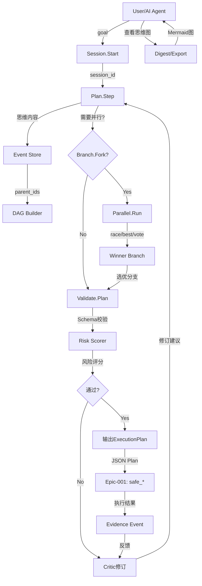
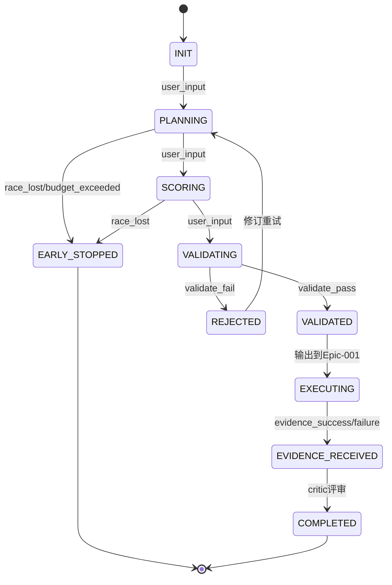

# [ACTIVE] Epic-003 技术架构：Graph-of-Thought引擎

**文档版本**: 1.0
**创建日期**: 2025-10-27
**负责人**: EvolvAI Team
**状态**: [ACTIVE]

---

## 📋 目录

1. [架构总览](#架构总览)
2. [核心组件](#核心组件)
3. [调度器状态机](#调度器状态机)
4. [失败策略切换表](#失败策略切换表)
5. [事件溯源实现](#事件溯源实现)
6. [并行调度策略](#并行调度策略)
7. [评分与决策算法](#评分与决策算法)
8. [与其他Epic的接口](#与其他epic的接口)
9. [技术选型](#技术选型)
10. [性能优化](#性能优化)
11. [安全与幂等性](#安全与幂等性)
12. [可观测性设计](#可观测性设计)

---

## 架构总览

### 设计原则

**核心理念**: 将AI推理从"长对话"升级为"可并行、可验证、可回放的图结构"

**关键约束**:
1. **GoT不可调用执行器**: 思维层只产出JSON Plan，不执行代码/文件操作
2. **强制Schema验证**: 所有Plan必须通过validate才能输出给Epic-001
3. **事件不可变**: append-only日志，乐观并发控制
4. **内容限长**: 单个思维步骤≤400字符，强制简洁
5. **预算硬限制**: Token/时间/分支数的硬上限，超限立即终止

### 系统分层

```
┌───────────────────────────────────────────────────────────┐
│                    MCP Interface Layer                     │
│  11个MCP工具：session, plan, branch, parallel, validate等   │
├───────────────────────────────────────────────────────────┤
│                  Orchestration Layer                       │
│  ├─ Session Manager (会话生命周期管理)                      │
│  ├─ Scheduler (调度器：状态机 + bandit策略)                 │
│  ├─ Budget Controller (预算控制器：准入与早停)               │
│  └─ Failure Classifier (失败分类器：签名匹配与自愈)          │
├───────────────────────────────────────────────────────────┤
│                   Graph Management Layer                   │
│  ├─ Event Store (事件存储：append-only + WAL)              │
│  ├─ DAG Builder (图构建器：parent_ids → 边表)               │
│  ├─ Branch Manager (分支管理：fork/merge/early_stop)       │
│  └─ Vector Clock (向量时钟：冲突检测)                       │
├───────────────────────────────────────────────────────────┤
│                  Validation & Scoring Layer                │
│  ├─ Schema Validator (Schema校验：JSON Schema + 自定义规则) │
│  ├─ Risk Scorer (风险评分：影响范围 + 未知符号率)            │
│  ├─ Completeness Checker (充分性检查：必填字段覆盖率)        │
│  └─ Critic Engine (批判引擎：失败驱动修订)                  │
├───────────────────────────────────────────────────────────┤
│                    Context Optimization Layer              │
│  ├─ Digest Generator (摘要生成器：≤200 tokens)             │
│  ├─ Redaction Filter (脱敏过滤：private vs public)          │
│  ├─ Compression (压缩：去冗余引用)                          │
│  └─ Export Engine (导出：Mermaid/JSON)                     │
├───────────────────────────────────────────────────────────┤
│                    Observability Layer                     │
│  ├─ Token Counter (token计数：分支/会话/累计)               │
│  ├─ Metrics Collector (指标收集：TPST/Model-hops等)         │
│  ├─ Audit Logger (审计日志：Plan→执行→验证链)               │
│  └─ Alerting (告警：预算超限/高风险Plan)                    │
├───────────────────────────────────────────────────────────┤
│                    Storage Layer                           │
│  ├─ SQLite (事件表 + 边表 + checkpoint表)                   │
│  ├─ WAL (Write-Ahead Log：崩溃恢复)                        │
│  └─ Failure Signature Store (失败签名库)                    │
└───────────────────────────────────────────────────────────┘
```

### 数据流



---

## 核心组件

### 1. Session Manager

**职责**: 管理思维会话的完整生命周期

**核心状态机**:
```python
class SessionState(Enum):
    INIT = "init"              # 会话创建
    ACTIVE = "active"          # 正常推理中
    BUDGET_WARNING = "warning" # 预算达到80%
    PAUSED = "paused"          # 用户暂停（可恢复）
    COMPLETED = "completed"    # 正常完成
    FAILED = "failed"          # 失败终止
    TIMEOUT = "timeout"        # 超时终止
    BUDGET_EXCEEDED = "budget_exceeded"  # 预算耗尽

class SessionManager:
    def start_session(
        self,
        goal: str,
        success_criteria: List[str],
        budgets: BudgetConfig
    ) -> Session:
        """启动新会话"""
        session = Session(
            id=f"sess_{uuid4()}",
            goal=goal,
            success_criteria=success_criteria,
            **budgets
        )
        # 初始化预算控制器
        self.budget_controller.register(session)
        # 写入初始checkpoint
        self.checkpoint_store.save(session)
        return session

    def checkpoint(self, session_id: str) -> bool:
        """保存检查点（支持崩溃恢复）"""
        session = self.get_session(session_id)
        # WAL flush
        self.wal.flush(session_id)
        # 保存快照
        self.checkpoint_store.save(session)
        return True

    def restore(self, session_id: str) -> Session:
        """从检查点恢复会话"""
        checkpoint = self.checkpoint_store.load_latest(session_id)
        # 重放checkpoint之后的事件
        events = self.event_store.get_events_after(
            session_id,
            checkpoint.last_event_id
        )
        # 重建状态
        session = self.rebuild_state(checkpoint, events)
        return session
```

### 2. Event Store（事件存储）

**职责**: 不可变事件日志，append-only存储

**Schema**:
```sql
CREATE TABLE events (
    id TEXT PRIMARY KEY,              -- evt_{uuid}
    session_id TEXT NOT NULL,
    idempotency_key TEXT UNIQUE,      -- 幂等键
    type TEXT NOT NULL,                -- plan_step/critique/branch/merge/validate/checkpoint/evidence
    parent_ids TEXT,                   -- JSON array of parent event IDs
    vector_clock TEXT,                 -- JSON dict {node_id: counter}

    -- 内容
    role TEXT NOT NULL,                -- planner/critic/tester/decider
    content TEXT NOT NULL CHECK(length(content) <= 400),  -- 强制限长
    constraints TEXT,                  -- JSON dict

    -- 评分
    score TEXT,                        -- JSON dict {completeness, risk, cost, history_prior}

    -- 状态
    status TEXT NOT NULL,              -- open/done/rejected/early_stopped
    early_stop_reason TEXT,

    -- 失败相关
    failure_signature TEXT,            -- SHA256(stderr+args)
    retry_count INTEGER DEFAULT 0,

    -- 元数据
    token_cost INTEGER DEFAULT 0,
    walltime_ms INTEGER DEFAULT 0,
    ts DATETIME DEFAULT CURRENT_TIMESTAMP,
    version INTEGER DEFAULT 1,

    INDEX idx_session (session_id, ts),
    INDEX idx_idempotency (idempotency_key),
    INDEX idx_failure (failure_signature)
);

CREATE TABLE edges (
    id INTEGER PRIMARY KEY AUTOINCREMENT,
    session_id TEXT NOT NULL,
    from_id TEXT NOT NULL,             -- 父事件ID
    to_id TEXT NOT NULL,               -- 子事件ID
    type TEXT,                         -- causes/refines/contradicts/supports

    FOREIGN KEY (from_id) REFERENCES events(id),
    FOREIGN KEY (to_id) REFERENCES events(id),
    INDEX idx_dag (session_id, from_id, to_id)
);

CREATE TABLE checkpoints (
    id INTEGER PRIMARY KEY AUTOINCREMENT,
    session_id TEXT NOT NULL,
    last_event_id TEXT NOT NULL,      -- 最后一个事件ID
    state_snapshot TEXT NOT NULL,     -- JSON序列化的完整Session状态
    ts DATETIME DEFAULT CURRENT_TIMESTAMP,

    INDEX idx_session_ts (session_id, ts DESC)
);
```

**幂等性保证**:
```python
def append_event(self, event: ThinkEvent) -> Result[str, ConflictError]:
    """追加事件（幂等）"""
    # 1. 检查幂等键
    existing = self.db.query(
        "SELECT id FROM events WHERE idempotency_key = ?",
        (event.idempotency_key,)
    )
    if existing:
        return Ok(existing.id)  # 已存在，返回现有ID

    # 2. 检查向量时钟冲突
    conflicts = self.detect_conflicts(event.vector_clock, event.parent_ids)
    if conflicts:
        return Err(ConflictError(409, conflicts))

    # 3. WAL写入（先写日志）
    self.wal.append(event)

    # 4. 写入事件表
    self.db.execute(
        "INSERT INTO events (...) VALUES (...)",
        event.to_tuple()
    )

    # 5. 写入边表
    for parent_id in event.parent_ids:
        self.db.execute(
            "INSERT INTO edges (session_id, from_id, to_id) VALUES (?, ?, ?)",
            (event.session_id, parent_id, event.id)
        )

    return Ok(event.id)
```

### 3. Scheduler（调度器）

**职责**: 状态机驱动的分支调度与早停决策

**状态机**（见下节详细说明）

**调度策略**:
```python
class SchedulerStrategy(Enum):
    RACE = "race"           # 第一个有效方案立即收敛
    BEST = "best"           # 评分最高方案（需全部完成）
    VOTE = "vote"           # 多数投票（需全部完成）
    BANDIT = "bandit"       # UCB策略动态分配预算

class Scheduler:
    def schedule_branches(
        self,
        session: Session,
        branches: List[Branch],
        strategy: SchedulerStrategy
    ) -> Branch:
        """调度并行分支"""
        if strategy == SchedulerStrategy.RACE:
            return self._race(session, branches)
        elif strategy == SchedulerStrategy.BANDIT:
            return self._bandit(session, branches)
        # ...

    def _race(self, session: Session, branches: List[Branch]) -> Branch:
        """Race策略：第一个通过validate的方案"""
        with ThreadPoolExecutor(max_workers=session.max_branches) as pool:
            futures = {
                pool.submit(self._execute_branch, b): b
                for b in branches
            }

            for future in as_completed(futures):
                branch = futures[future]
                result = future.result()

                if result.status == "validated":
                    # 立即终止其他分支
                    for f in futures:
                        f.cancel()
                    # 记录早停
                    self._record_early_stop(
                        session,
                        winner=branch,
                        eliminated=[b for b in branches if b != branch],
                        reason="race_winner"
                    )
                    return branch

    def _bandit(self, session: Session, branches: List[Branch]) -> Branch:
        """UCB Bandit策略：动态分配预算"""
        # UCB公式: score + sqrt(2 * ln(total_pulls) / branch_pulls)
        remaining_budget = session.token_budget - session.token_used
        pulls = {b.id: 0 for b in branches}

        while remaining_budget > 0:
            # 选择UCB最高的分支
            branch = max(
                branches,
                key=lambda b: self._ucb_score(b, pulls, remaining_budget)
            )

            # 分配一轮预算（例如200 tokens）
            result = self._execute_branch_round(branch, budget=200)
            pulls[branch.id] += 1
            remaining_budget -= result.token_cost

            # 如果该分支已通过validate，立即收敛
            if result.status == "validated":
                return branch

        # 预算耗尽，选择最佳分支
        return max(branches, key=lambda b: b.score["expected_gain"])
```

---

## 调度器状态机

### 状态定义

```python
class BranchState(Enum):
    INIT = "init"                    # 分支创建
    PLANNING = "planning"            # 正在规划
    SCORING = "scoring"              # 评分中
    VALIDATING = "validating"        # Schema校验中
    VALIDATED = "validated"          # 通过校验
    REJECTED = "rejected"            # 校验失败
    EXECUTING = "executing"          # 等待Epic-001执行（非GoT内执行）
    EVIDENCE_RECEIVED = "evidence_received"  # 收到执行反馈
    EARLY_STOPPED = "early_stopped"  # 早停淘汰
    COMPLETED = "completed"          # 完成

class TransitionTrigger(Enum):
    USER_INPUT = "user_input"
    VALIDATE_PASS = "validate_pass"
    VALIDATE_FAIL = "validate_fail"
    RACE_LOST = "race_lost"
    BUDGET_EXCEEDED = "budget_exceeded"
    EVIDENCE_SUCCESS = "evidence_success"
    EVIDENCE_FAILURE = "evidence_failure"
```

### 状态转移表

```python
STATE_TRANSITIONS = {
    BranchState.INIT: {
        TransitionTrigger.USER_INPUT: BranchState.PLANNING,
    },
    BranchState.PLANNING: {
        TransitionTrigger.USER_INPUT: BranchState.SCORING,
        TransitionTrigger.RACE_LOST: BranchState.EARLY_STOPPED,
        TransitionTrigger.BUDGET_EXCEEDED: BranchState.EARLY_STOPPED,
    },
    BranchState.SCORING: {
        TransitionTrigger.USER_INPUT: BranchState.VALIDATING,
        TransitionTrigger.RACE_LOST: BranchState.EARLY_STOPPED,
    },
    BranchState.VALIDATING: {
        TransitionTrigger.VALIDATE_PASS: BranchState.VALIDATED,
        TransitionTrigger.VALIDATE_FAIL: BranchState.REJECTED,
    },
    BranchState.VALIDATED: {
        TransitionTrigger.USER_INPUT: BranchState.EXECUTING,  # 输出到Epic-001
    },
    BranchState.REJECTED: {
        TransitionTrigger.USER_INPUT: BranchState.PLANNING,  # 修订重试
    },
    BranchState.EXECUTING: {
        TransitionTrigger.EVIDENCE_SUCCESS: BranchState.EVIDENCE_RECEIVED,
        TransitionTrigger.EVIDENCE_FAILURE: BranchState.EVIDENCE_RECEIVED,
    },
    BranchState.EVIDENCE_RECEIVED: {
        TransitionTrigger.USER_INPUT: BranchState.COMPLETED,  # critic评审后完成
    },
}
```

### 状态机可视化



---

## 失败策略切换表

### 失败分类

```python
class FailureCategory(Enum):
    # 权限相关
    PERMISSION_DENIED = "permission_denied"
    ACCESS_FORBIDDEN = "access_forbidden"

    # 资源相关
    FILE_NOT_FOUND = "file_not_found"
    PORT_IN_USE = "port_in_use"
    LOCK_HELD = "lock_held"
    DISK_FULL = "disk_full"

    # 依赖相关
    MISSING_DEPENDENCY = "missing_dependency"
    VERSION_MISMATCH = "version_mismatch"
    IMPORT_ERROR = "import_error"

    # 路径相关
    PATH_NON_COMPLIANT = "path_non_compliant"  # 违反Epic-002规范
    PATH_OUTSIDE_PROJECT = "path_outside_project"

    # 测试相关
    TEST_FAILED = "test_failed"
    ASSERTION_ERROR = "assertion_error"
    SYNTAX_ERROR = "syntax_error"

    # 执行相关
    TIMEOUT = "timeout"
    OUT_OF_MEMORY = "out_of_memory"
    RECURSION_LIMIT = "recursion_limit"

    # 未知
    UNKNOWN = "unknown"
```

### 失败签名生成

```python
def generate_failure_signature(
    stderr: str,
    args: dict,
    exit_code: int
) -> str:
    """生成失败签名（用于去重）"""
    # 提取关键信息
    error_type = extract_error_type(stderr)  # e.g., "PermissionError"
    error_msg = normalize_error_msg(stderr)  # 去除路径、行号等变量
    tool_name = args.get("tool")
    key_args = frozenset(args.items())

    # 组合并hash
    signature_data = f"{error_type}|{error_msg}|{tool_name}|{key_args}|{exit_code}"
    return hashlib.sha256(signature_data.encode()).hexdigest()[:16]

def classify_failure(stderr: str, exit_code: int) -> FailureCategory:
    """失败分类"""
    patterns = {
        FailureCategory.PERMISSION_DENIED: r"(PermissionError|Permission denied|EACCES)",
        FailureCategory.FILE_NOT_FOUND: r"(FileNotFoundError|No such file|ENOENT)",
        FailureCategory.PORT_IN_USE: r"(Address already in use|EADDRINUSE)",
        FailureCategory.MISSING_DEPENDENCY: r"(ModuleNotFoundError|ImportError|cannot find)",
        FailureCategory.TEST_FAILED: r"(FAILED|AssertionError|test.*failed)",
        FailureCategory.TIMEOUT: r"(TimeoutError|timed out|ETIMEDOUT)",
        # ...
    }

    for category, pattern in patterns.items():
        if re.search(pattern, stderr, re.IGNORECASE):
            return category

    return FailureCategory.UNKNOWN
```

### 自愈策略表

```python
HEALING_STRATEGIES = {
    FailureCategory.PERMISSION_DENIED: [
        {"action": "switch_tool", "from": "direct_write", "to": "safe_edit"},
        {"action": "request_approval", "message": "需要提升权限"},
    ],

    FailureCategory.FILE_NOT_FOUND: [
        {"action": "expand_context", "type": "symbol_search", "query": "find_alternate_location"},
        {"action": "suggest_create", "template": "default"},
    ],

    FailureCategory.PORT_IN_USE: [
        {"action": "find_free_port", "range": "8000-9000"},
        {"action": "kill_process", "require_approval": True},
    ],

    FailureCategory.LOCK_HELD: [
        {"action": "reduce_concurrency", "max_parallel": 1},
        {"action": "retry_with_backoff", "max_attempts": 3, "backoff_ms": [100, 500, 2000]},
    ],

    FailureCategory.MISSING_DEPENDENCY: [
        {"action": "suggest_install", "package_manager": "auto_detect"},
        {"action": "switch_tool", "to": "fallback"},  # e.g., rg → grep
    ],

    FailureCategory.PATH_NON_COMPLIANT: [
        {"action": "doc_suggest", "service": "Epic-002"},  # 调用Epic-002.suggest
        {"action": "ask_user", "options": "auto_fix/manual"},
    ],

    FailureCategory.TEST_FAILED: [
        {"action": "analyze_diff", "tool": "git_diff"},
        {"action": "expand_context", "type": "test_only", "affected": True},
        {"action": "rollback", "strategy": "git_revert"},
    ],

    FailureCategory.TIMEOUT: [
        {"action": "batch_reduce", "factor": 0.5},  # 减半批量大小
        {"action": "increase_timeout", "multiplier": 2},
    ],

    FailureCategory.SYNTAX_ERROR: [
        {"action": "rollback", "strategy": "git_revert"},
        {"action": "parse_error", "tool": "ast_parser"},
    ],

    FailureCategory.UNKNOWN: [
        {"action": "log_for_review", "priority": "high"},
        {"action": "ask_user", "include_stderr": True},
    ],
}
```

### 策略匹配引擎

```python
class HealingEngine:
    def __init__(self):
        self.history = {}  # 历史成功率: {(category, action): success_rate}

    def select_strategy(
        self,
        category: FailureCategory,
        context: dict
    ) -> dict:
        """选择最优自愈策略"""
        strategies = HEALING_STRATEGIES.get(category, [])

        # 按历史成功率排序
        scored = []
        for strategy in strategies:
            action = strategy["action"]
            key = (category, action)
            success_rate = self.history.get(key, 0.5)  # 默认50%
            scored.append((success_rate, strategy))

        scored.sort(reverse=True, key=lambda x: x[0])

        # 返回最佳策略
        if scored:
            return scored[0][1]
        else:
            return {"action": "ask_user", "include_stderr": True}

    def record_outcome(
        self,
        category: FailureCategory,
        action: str,
        success: bool
    ):
        """记录策略执行结果"""
        key = (category, action)
        # 指数移动平均
        current = self.history.get(key, 0.5)
        alpha = 0.3  # 学习率
        new_value = alpha * (1.0 if success else 0.0) + (1 - alpha) * current
        self.history[key] = new_value
```

### 失败签名去重

```python
class FailureDeduplicator:
    def __init__(self, max_retries: int = 3):
        self.max_retries = max_retries
        self.signatures = {}  # {signature: retry_count}

    def should_retry(
        self,
        signature: str,
        category: FailureCategory
    ) -> tuple[bool, Optional[str]]:
        """判断是否应该重试"""
        count = self.signatures.get(signature, 0)

        # 已达到最大重试次数
        if count >= self.max_retries:
            reason = f"失败签名{signature[:8]}已重试{count}次，切换策略"
            return False, reason

        # 某些类别不应重试（例如语法错误）
        if category in [
            FailureCategory.SYNTAX_ERROR,
            FailureCategory.PATH_OUTSIDE_PROJECT
        ]:
            reason = f"失败类型{category}不应重试，需修正"
            return False, reason

        # 允许重试
        self.signatures[signature] = count + 1
        return True, None
```

---

## 事件溯源实现

### 向量时钟冲突检测

```python
class VectorClock:
    """向量时钟（检测并发冲突）"""
    def __init__(self, node_id: str):
        self.node_id = node_id
        self.clock = {node_id: 0}

    def increment(self):
        """本地递增"""
        self.clock[self.node_id] += 1

    def merge(self, other: dict):
        """合并其他节点时钟"""
        for node, counter in other.items():
            self.clock[node] = max(self.clock.get(node, 0), counter)
        self.increment()

    def happens_before(self, other: dict) -> bool:
        """检查因果关系"""
        # self < other: self的所有计数器 <= other的计数器，且至少一个<
        return (
            all(self.clock.get(node, 0) <= other.get(node, 0) for node in self.clock)
            and any(self.clock.get(node, 0) < other.get(node, 0) for node in other)
        )

    def is_concurrent(self, other: dict) -> bool:
        """检测并发（冲突）"""
        return not (self.happens_before(other) or VectorClock.static_happens_before(other, self.clock))

    @staticmethod
    def static_happens_before(a: dict, b: dict) -> bool:
        """静态方法：检查a < b"""
        return (
            all(a.get(node, 0) <= b.get(node, 0) for node in a)
            and any(a.get(node, 0) < b.get(node, 0) for node in b)
        )

def detect_conflict(
    new_event: ThinkEvent,
    parent_events: List[ThinkEvent]
) -> Optional[ConflictError]:
    """检测事件冲突"""
    new_clock = new_event.vector_clock

    for parent in parent_events:
        parent_clock = parent.vector_clock

        # 检查是否满足因果关系
        if not VectorClock.static_happens_before(parent_clock, new_clock):
            return ConflictError(
                409,
                f"事件{new_event.id}与父事件{parent.id}冲突（并发写入）",
                resolution="请重新获取最新状态并重试"
            )

    return None
```

### WAL与崩溃恢复

```python
class WriteAheadLog:
    """预写日志（WAL）"""
    def __init__(self, path: Path):
        self.path = path
        self.file = open(path, "ab")  # append binary

    def append(self, event: ThinkEvent):
        """追加事件到WAL"""
        # 序列化为JSON
        data = event.json().encode("utf-8")
        # 写入长度前缀（4字节）
        length = len(data)
        self.file.write(length.to_bytes(4, "little"))
        # 写入数据
        self.file.write(data)
        # 立即flush（确保持久化）
        self.file.flush()
        os.fsync(self.file.fileno())

    def replay(self) -> List[ThinkEvent]:
        """重放WAL（崩溃恢复）"""
        events = []
        with open(self.path, "rb") as f:
            while True:
                # 读取长度
                length_bytes = f.read(4)
                if not length_bytes:
                    break
                length = int.from_bytes(length_bytes, "little")
                # 读取数据
                data = f.read(length)
                # 反序列化
                event = ThinkEvent.parse_raw(data)
                events.append(event)
        return events

    def truncate_before(self, checkpoint_id: str):
        """截断checkpoint之前的日志"""
        events = self.replay()
        # 找到checkpoint位置
        idx = next(
            (i for i, e in enumerate(events) if e.id == checkpoint_id),
            None
        )
        if idx is None:
            return  # checkpoint不在WAL中

        # 重写WAL（只保留checkpoint之后的事件）
        self.file.close()
        self.file = open(self.path, "wb")
        for event in events[idx + 1:]:
            self.append(event)
```

### Checkpoint策略

```python
class CheckpointStrategy:
    """检查点策略"""
    def __init__(
        self,
        interval_events: int = 100,  # 每100个事件
        interval_time: int = 300,    # 每5分钟
    ):
        self.interval_events = interval_events
        self.interval_time = interval_time
        self.last_checkpoint_time = time.time()
        self.events_since_checkpoint = 0

    def should_checkpoint(self) -> bool:
        """判断是否应该创建检查点"""
        now = time.time()
        time_elapsed = now - self.last_checkpoint_time

        return (
            self.events_since_checkpoint >= self.interval_events
            or time_elapsed >= self.interval_time
        )

    def on_event(self):
        """事件计数"""
        self.events_since_checkpoint += 1

    def on_checkpoint(self):
        """重置计数"""
        self.events_since_checkpoint = 0
        self.last_checkpoint_time = time.time()
```

---

## 并行调度策略

### Bandit算法（UCB）

```python
import math

class UCBScheduler:
    """Upper Confidence Bound调度器"""
    def __init__(self, c: float = math.sqrt(2)):
        self.c = c  # 探索系数
        self.pulls = {}  # {branch_id: pull_count}
        self.rewards = {}  # {branch_id: [reward1, reward2, ...]}
        self.total_pulls = 0

    def select_branch(self, branches: List[Branch]) -> Branch:
        """选择UCB最高的分支"""
        ucb_scores = {}
        for branch in branches:
            branch_id = branch.id
            pulls = self.pulls.get(branch_id, 0)

            if pulls == 0:
                # 未探索过的分支，优先级最高
                ucb_scores[branch_id] = float("inf")
            else:
                # UCB公式
                mean_reward = sum(self.rewards[branch_id]) / pulls
                exploration = self.c * math.sqrt(math.log(self.total_pulls) / pulls)
                ucb_scores[branch_id] = mean_reward + exploration

        # 返回UCB最高的分支
        best_branch_id = max(ucb_scores, key=ucb_scores.get)
        return next(b for b in branches if b.id == best_branch_id)

    def update(self, branch_id: str, reward: float):
        """更新分支奖励"""
        self.pulls[branch_id] = self.pulls.get(branch_id, 0) + 1
        self.rewards.setdefault(branch_id, []).append(reward)
        self.total_pulls += 1

def calculate_reward(branch: Branch) -> float:
    """计算分支奖励"""
    score = branch.score

    # 组合多维度评分
    completeness = score.get("completeness", 0)      # 0-1
    risk = score.get("risk", 0.5)                     # 0-1（越低越好）
    cost = score.get("cost", 1000)                    # tokens（越少越好）
    history_prior = score.get("history_prior", 0.5)  # 0-1

    # 加权组合（可调整权重）
    reward = (
        0.4 * completeness
        + 0.3 * (1 - risk)
        + 0.2 * (1 - min(cost / 2000, 1))  # 归一化cost
        + 0.1 * history_prior
    )

    return reward
```

### 早停规则

```python
class EarlyStoppingRules:
    """早停规则集合"""
    @staticmethod
    def budget_based(session: Session) -> bool:
        """预算驱动早停"""
        token_used_ratio = session.token_used / session.token_budget
        time_used_ratio = session.walltime_elapsed / session.time_budget

        # 任一资源超过90%，触发早停
        return token_used_ratio > 0.9 or time_used_ratio > 0.9

    @staticmethod
    def quality_based(branches: List[Branch]) -> Optional[Branch]:
        """质量驱动早停"""
        for branch in branches:
            score = branch.score
            # 如果某分支completeness=1.0且risk<0.2，立即收敛
            if score.get("completeness", 0) == 1.0 and score.get("risk", 1) < 0.2:
                return branch
        return None

    @staticmethod
    def convergence_based(branches: List[Branch], threshold: float = 0.1) -> bool:
        """收敛驱动早停"""
        if len(branches) < 2:
            return False

        # 计算分支间的奖励方差
        rewards = [calculate_reward(b) for b in branches]
        variance = sum((r - sum(rewards) / len(rewards)) ** 2 for r in rewards) / len(rewards)

        # 如果方差很小（说明分支质量相近），提前收敛
        return variance < threshold
```

---

## 评分与决策算法

### 风险评分器

```python
class RiskScorer:
    """风险评分器"""
    def score(self, plan: ExecutionPlanExtended, context: dict) -> dict:
        """综合风险评分"""
        # 1. 影响范围风险
        scope_risk = self._scope_risk(plan.limits)

        # 2. 测试覆盖风险
        test_risk = self._test_coverage_risk(plan.risk_estimate)

        # 3. 未知符号风险
        unknown_symbols_risk = self._unknown_symbols_risk(plan.context_sufficiency)

        # 4. 历史失败率
        history_risk = self._history_risk(plan, context)

        # 加权组合
        total_risk = (
            0.3 * scope_risk
            + 0.3 * test_risk
            + 0.2 * unknown_symbols_risk
            + 0.2 * history_risk
        )

        return {
            "total_risk": total_risk,
            "scope_risk": scope_risk,
            "test_risk": test_risk,
            "unknown_symbols_risk": unknown_symbols_risk,
            "history_risk": history_risk,
            "assessment": self._risk_level(total_risk)
        }

    def _scope_risk(self, limits: dict) -> float:
        """影响范围风险（文件数、行数）"""
        max_changes = limits.get("max_changes", 100)
        max_files = limits.get("max_files", 10)

        # 简单线性归一化
        changes_risk = min(max_changes / 500, 1.0)  # 500行=高风险
        files_risk = min(max_files / 50, 1.0)       # 50文件=高风险

        return max(changes_risk, files_risk)

    def _test_coverage_risk(self, risk_estimate: dict) -> float:
        """测试覆盖风险"""
        coverage = risk_estimate.get("test_coverage", 0)
        # 低覆盖=高风险
        return 1.0 - coverage

    def _unknown_symbols_risk(self, context_sufficiency: dict) -> float:
        """未知符号风险"""
        unresolved_rate = context_sufficiency.get("unresolved_symbol_rate", 0.1)
        # 超过5%未解析符号=高风险
        return min(unresolved_rate / 0.05, 1.0)

    def _history_risk(self, plan: ExecutionPlanExtended, context: dict) -> float:
        """历史失败率风险"""
        # 查询类似操作的历史成功率
        similar_ops = context.get("similar_operations", [])
        if not similar_ops:
            return 0.5  # 无历史数据，中等风险

        success_rate = sum(op["success"] for op in similar_ops) / len(similar_ops)
        return 1.0 - success_rate

    def _risk_level(self, risk: float) -> str:
        """风险等级"""
        if risk < 0.2:
            return "low"
        elif risk < 0.5:
            return "medium"
        elif risk < 0.7:
            return "high"
        else:
            return "critical"
```

### 充分性检查器

```python
class CompletenessChecker:
    """充分性检查器"""
    REQUIRED_FIELDS = {
        "ExecutionPlan": [
            "dry_run",
            "rollback",
            "limits",
            "capabilities_required",
            "success_criteria"
        ],
        "DocPlan": [
            "target_path",
            "naming_convention",
            "structure_template",
            "validation_rules"
        ]
    }

    def check(self, plan: dict, plan_type: str) -> dict:
        """检查计划充分性"""
        required = self.REQUIRED_FIELDS.get(plan_type, [])

        missing = [field for field in required if field not in plan or plan[field] is None]

        completeness = 1.0 - (len(missing) / len(required)) if required else 1.0

        return {
            "completeness": completeness,
            "missing_fields": missing,
            "required_fields_coverage": completeness,
            "ok": len(missing) == 0
        }

    def check_context_sufficiency(self, context: dict) -> dict:
        """检查上下文充分性"""
        unresolved_rate = context.get("unresolved_symbol_rate", 0)
        callgraph_coverage = context.get("callgraph_coverage", 0)

        sufficient = (
            unresolved_rate < 0.05
            and callgraph_coverage > 0.9
        )

        return {
            "sufficient": sufficient,
            "unresolved_symbol_rate": unresolved_rate,
            "callgraph_coverage": callgraph_coverage,
            "recommendation": "expand_context" if not sufficient else "proceed"
        }
```

---

## 与其他Epic的接口

### 与Epic-001的集成

**数据流**:
```
GoT (Epic-003) →[ExecutionPlan JSON]→ ExecutionController →[校验]→ safe_* (Epic-001) →[执行]→ Evidence →[反馈]→ GoT
```

**ExecutionPlan输出接口**:
```python
@mcp_tool
def think_export_plan(
    session_id: str,
    branch_id: str
) -> dict:
    """导出ExecutionPlan给Epic-001"""
    branch = self.branch_manager.get_branch(session_id, branch_id)

    # 必须是validated状态
    if branch.state != BranchState.VALIDATED:
        raise ValueError(f"分支{branch_id}未通过校验，无法导出")

    # 提取Plan
    plan = branch.execution_plan

    # 添加GoT元数据
    plan["_got_metadata"] = {
        "session_id": session_id,
        "branch_id": branch_id,
        "confidence": branch.score.get("expected_gain", 0),
        "alternatives_explored": len(self.branch_manager.get_branches(session_id)),
        "token_cost": sum(e.token_cost for e in branch.events),
    }

    return plan
```

**Evidence反馈接口**:
```python
@mcp_tool
def think_receive_evidence(
    session_id: str,
    branch_id: str,
    execution_result: dict  # 来自Epic-001的执行结果
) -> dict:
    """接收Epic-001的执行反馈"""
    # 创建Evidence事件
    evidence = ThinkEvent(
        id=f"evt_{uuid4()}",
        session_id=session_id,
        idempotency_key=f"{session_id}:{branch_id}:evidence:{execution_result['execution_id']}",
        type="evidence",
        parent_ids=[branch_id],
        role="tester",
        content=f"执行{'成功' if execution_result['success'] else '失败'}: {execution_result['summary'][:300]}",
        score={
            "success": execution_result["success"],
            "tests_passed": execution_result.get("tests_passed", 0),
            "tests_failed": execution_result.get("tests_failed", 0),
        },
        status="done"
    )

    # 写入事件
    self.event_store.append_event(evidence)

    # 触发critic评审
    critic_needed = not execution_result["success"]

    return {
        "evidence_id": evidence.id,
        "critic_needed": critic_needed,
        "next_step": "critic_review" if critic_needed else "complete"
    }
```

### 与Epic-002的集成

**DocPlan输出接口**:
```python
@mcp_tool
def think_export_doc_plan(
    session_id: str,
    branch_id: str
) -> dict:
    """导出DocPlan给Epic-002"""
    branch = self.branch_manager.get_branch(session_id, branch_id)

    if branch.state != BranchState.VALIDATED:
        raise ValueError(f"分支{branch_id}未通过校验，无法导出")

    doc_plan = branch.doc_plan

    doc_plan["_got_metadata"] = {
        "session_id": session_id,
        "branch_id": branch_id,
        "token_cost": sum(e.token_cost for e in branch.events),
    }

    return doc_plan
```

**规范校验反馈**:
```python
@mcp_tool
def think_receive_doc_validation(
    session_id: str,
    branch_id: str,
    validation_result: dict  # 来自Epic-002的校验结果
) -> dict:
    """接收Epic-002的规范校验反馈"""
    evidence = ThinkEvent(
        id=f"evt_{uuid4()}",
        session_id=session_id,
        idempotency_key=f"{session_id}:{branch_id}:doc_validation:{validation_result['validation_id']}",
        type="evidence",
        parent_ids=[branch_id],
        role="critic",
        content=f"规范校验: {validation_result['summary'][:300]}",
        score={
            "compliance": validation_result["compliance_score"],
            "placement_correct": validation_result["placement_correct"],
        },
        status="done"
    )

    self.event_store.append_event(evidence)

    return {
        "evidence_id": evidence.id,
        "compliant": validation_result["compliance_score"] >= 0.95
    }
```

---

## 技术选型

### 存储层

**选择**: SQLite + WAL

**理由**:
- ✅ 单机部署，无需额外服务
- ✅ ACID保证，可靠性高
- ✅ WAL模式支持并发读写
- ✅ 轻量级，嵌入式
- ✅ Python `sqlite3`标准库支持

**替代方案对比**:

| 方案 | 优点 | 缺点 | 适用场景 |
|------|------|------|----------|
| **SQLite+WAL** | 简单、可靠、ACID | 单机，不支持分布式 | MVP、单机部署 ✅ |
| LiteFS | 分布式、复制 | 复杂度高、运维成本 | 多节点部署 |
| PostgreSQL | 功能强大、分布式 | 需要独立服务 | 大规模生产 |
| 纯内存+序列化 | 极快 | 不持久化、崩溃丢失 | 原型验证 |

**决策**: MVP使用SQLite+WAL，长期考虑LiteFS/PostgreSQL

### 并行执行

**选择**: `concurrent.futures.ThreadPoolExecutor`

**理由**:
- ✅ Python标准库，无需额外依赖
- ✅ 简单易用，适合IO密集型任务
- ✅ 支持`as_completed`（race策略）
- ✅ 线程池复用，避免频繁创建线程

**替代方案对比**:

| 方案 | 优点 | 缺点 | 适用场景 |
|------|------|------|----------|
| **ThreadPoolExecutor** | 标准库、简单 | GIL限制CPU | IO密集✅ |
| ProcessPoolExecutor | 无GIL限制 | 进程创建开销大 | CPU密集 |
| asyncio | 高并发 | 复杂度高、生态碎片 | 极高并发 |

**决策**: MVP使用ThreadPoolExecutor，IO密集足够

### Schema校验

**选择**: JSON Schema + Pydantic

**理由**:
- ✅ JSON Schema标准化、可移植
- ✅ Pydantic自动校验、类型安全
- ✅ 良好的错误消息
- ✅ 支持自定义校验器

**示例**:
```python
from pydantic import BaseModel, validator

class ExecutionPlanExtended(BaseModel):
    dry_run: bool = True
    rollback: dict
    limits: dict

    @validator("rollback")
    def validate_rollback(cls, v):
        if "strategy" not in v:
            raise ValueError("rollback必须包含strategy字段")
        allowed_strategies = ["git_revert", "backup_restore", "none"]
        if v["strategy"] not in allowed_strategies:
            raise ValueError(f"不支持的rollback策略: {v['strategy']}")
        return v

    @validator("limits")
    def validate_limits(cls, v):
        if "max_changes" not in v:
            raise ValueError("limits必须包含max_changes字段")
        if v["max_changes"] > 1000:
            raise ValueError(f"max_changes不能超过1000（当前: {v['max_changes']}）")
        return v
```

---

## 性能优化

### 1. Token优化

**目标**: 思考token占比从40%降到15%

**策略**:
- **限长强制**: 单个思维步骤≤400字符
- **Digest摘要**: 只传≤200 token的摘要给LLM，历史靠MCP拉取
- **去冗余**: 通过事件ID引用，避免重复传输完整内容
- **早停**: race策略尽早收敛，避免无效探索

**示例**:
```python
# 传统对话（冗长）
"""
我觉得可以用三种方案：
1. 方案A：使用文本替换...（详细描述200字）
2. 方案B：使用AST重构...（详细描述250字）
3. 方案C：使用codemod...（详细描述220字）
权衡后，我选择方案B，因为...（详细论证150字）
"""
# Token成本: ~800 tokens

# GoT（简洁）
"""
fork [plan_a, plan_b, plan_c]
parallel.run(race)
winner: plan_b (risk=0.2, completeness=1.0)
validate.plan(plan_b) → ✅
"""
# Token成本: ~150 tokens
# 详细内容在事件图中，按需查看
```

### 2. 并行优化

**目标**: 并行分支加速2-3x

**策略**:
- **ThreadPool复用**: 避免频繁创建线程
- **IO优先**: 思维推理是IO密集（LLM API调用），线程池足够
- **限制并发**: max_branches=3-5，避免资源争抢
- **早停**: race策略一旦有胜者立即cancel其他future

### 3. 缓存优化

**策略**:
- **事件缓存**: 热点事件（近期访问）缓存在内存
- **Schema缓存**: JSON Schema编译后缓存
- **失败签名缓存**: 内存LRU缓存，避免频繁查DB

```python
from functools import lru_cache

@lru_cache(maxsize=1000)
def get_event(event_id: str) -> ThinkEvent:
    """带缓存的事件获取"""
    return db.query("SELECT * FROM events WHERE id = ?", (event_id,))

@lru_cache(maxsize=100)
def get_failure_strategy(category: FailureCategory) -> dict:
    """带缓存的失败策略查询"""
    return HEALING_STRATEGIES.get(category, [])
```

---

## 安全与幂等性

### 1. 幂等性保证

**机制**:
- **Idempotency Key**: 每个事件必须提供幂等键
- **409冲突返回**: 重复提交返回现有事件ID，不创建新事件
- **客户端生成ID**: 客户端生成UUID + 语义信息组成幂等键

**示例**:
```python
idempotency_key = f"{session_id}:plan_step:{step_index}:{hash(content[:50])}"
```

### 2. 并发冲突检测

**向量时钟**: 检测并发写入，拒绝冲突事件

**乐观锁**: 事件引用parent_ids，如果parent已被其他事件修改，拒绝写入

### 3. 沙箱隔离

**GoT不可执行**: GoT层不允许调用文件操作、shell命令

**强制边界**: GoT只能产出JSON Plan，执行必须通过Epic-001的safe_*工具

---

## 可观测性设计

### 1. Token审计条

**实时显示**:
```
┌─────────────────────────────────────────┐
│ Token Budget: [████████░░] 4200/5000   │
│ Current Branch: plan_b (850 tokens)    │
│ Total Branches: 3 (2100 tokens)        │
│ Estimated: 5000 tokens (within budget) │
└─────────────────────────────────────────┘
```

**实现**:
```python
class TokenAuditor:
    def get_audit_bar(self, session: Session) -> str:
        """生成token审计条"""
        used = session.token_used
        budget = session.token_budget
        ratio = used / budget

        bar_length = 10
        filled = int(ratio * bar_length)
        bar = "█" * filled + "░" * (bar_length - filled)

        return f"Token Budget: [{bar}] {used}/{budget}"
```

### 2. 指标收集

**分支级指标**:
```python
{
    "branch_id": "branch_2",
    "tokens": 850,
    "latency_ms": 2300,
    "score": {"completeness": 0.9, "risk": 0.2},
    "early_stopped": False,
    "outcome": "validated"
}
```

**会话级指标**:
```python
{
    "session_id": "sess_abc123",
    "tpst": 4200,  # Total Prompt and Sampling Tokens
    "model_hops": 3,
    "first_pass_success": True,
    "waste_ratio": 0.15,  # 15%的token是探索失败分支
    "early_stop_count": 2
}
```

### 3. 审计日志

**证据链**:
```
Plan (branch_2) → validate ✅ → ExecutionPlan → safe_edit(dry_run) → diff preview → confirm → execute → tests ✅ → evidence ✅ → complete
```

**格式**:
```json
{
    "session_id": "sess_abc123",
    "evidence_chain": [
        {"step": "plan", "event_id": "evt_123", "status": "done"},
        {"step": "validate", "event_id": "evt_124", "status": "pass"},
        {"step": "execution", "tool": "safe_edit", "status": "success"},
        {"step": "tests", "passed": 42, "failed": 0},
        {"step": "evidence", "event_id": "evt_125", "status": "done"}
    ],
    "outcome": "completed",
    "tpst": 4200
}
```

---

## 实施优先级

### Phase 1: 核心引擎（Week 1）

**目标**: MVP可运行，单分支思维流程

**交付物**:
- Session管理（start/checkpoint/restore）
- Event Store（append-only + WAL）
- 单线性思维流程（plan_step → validate → output）

### Phase 2: 并行与验证（Week 2）

**目标**: 多分支并行 + Schema校验

**交付物**:
- Branch管理（fork/merge/early_stop）
- Parallel.run（race策略）
- Schema校验（ExecutionPlan/DocPlan）
- 与Epic-001集成测试

### Phase 3: 工程化能力（Week 3）

**目标**: 生产级可靠性与可观测性

**交付物**:
- 预算控制与早停
- 失败分类与自愈
- Token审计条
- 指标收集与审计日志

---

**最后更新**: 2025-10-27
**维护者**: EvolvAI Team
